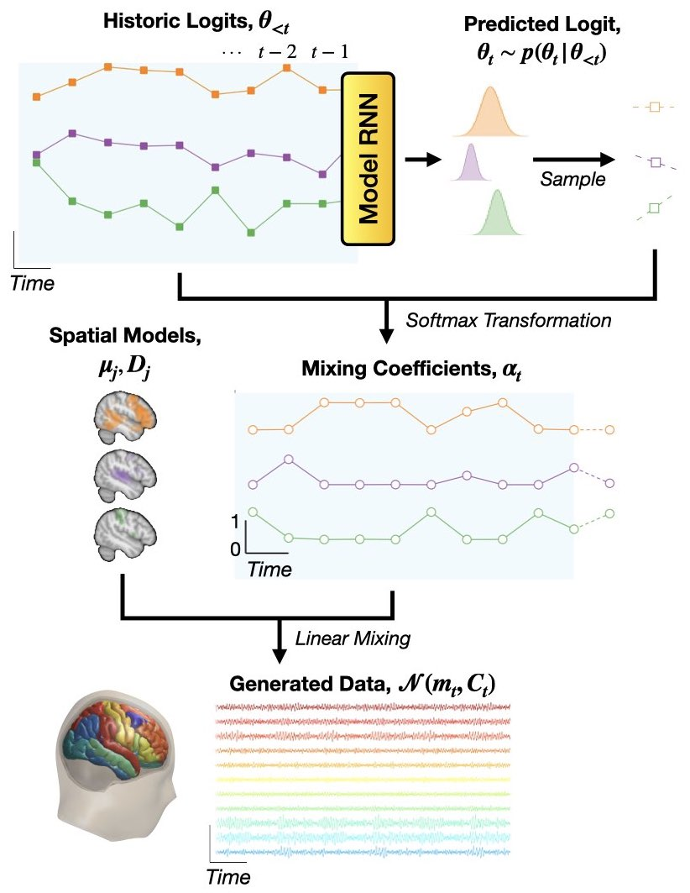
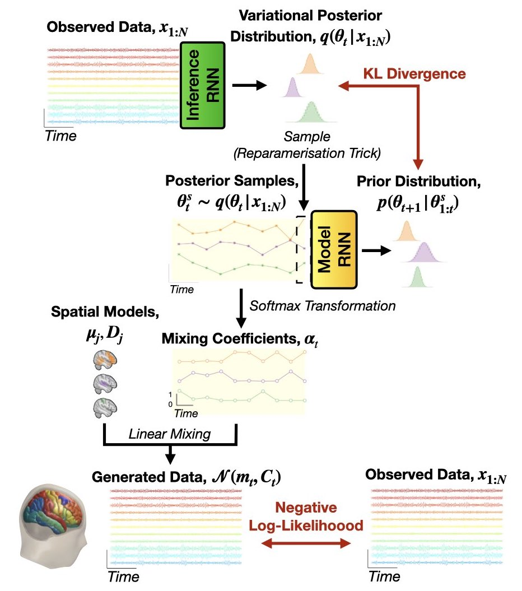

:orphan:

Dynamic Network Modes (DyNeMo)
==============================

Introduction
------------

DyNeMo overcomes two limitations of the `HMM <hmm.html>`_:

- The **Markovian assumption**: DyNeMo uses a recurrent neural network (LSTM [1]) to model long-range temporal dependencies in the latent variable.
- The **mutual exclusivity of states**: DyNeMo models the data using a linear mixture of '**modes**'.

DyNeMo was used to study MEG data in [2].

Generative Model
----------------

Mathematically, the generative model (joint probability distribution) is

.. math::
    p(x_{1:T}, \theta_{1:T}) = p(x_1 | \theta_1) p(\theta_1) \prod_{t=2}^T p(x_t | \theta_t) p(\theta_t | \theta_{1:t-1}),

where :math:`x_{1:T}` denotes a sequence of observed data (:math:`x_1, x_2, ..., x_T`) and :math:`\theta_{1:T}` is a sequence of latent variables (:math:`\theta_1, \theta_2, ..., \theta_T`), which we will call `logits` (because we feed them to a softmax transform, see below).

The observation model we use in DyNeMo is:

.. math::
    p(x_t | \theta_t) = \mathcal{N}(m_t, C_t)

where the time-varying mean and covariance is a **linear mixture** of mode means, :math:`\mu_j`, and covariances, :math:`D_j`:

.. math::
    m_t = \displaystyle\sum_j \alpha_{jt} \mu_j, ~~ C_t = \displaystyle\sum_j \alpha_{jt} D_j

The mixing coefficients :math:`\alpha_{jt}` are enforced to be positive and sum to one by softmax transforming the underlying logits:

.. math::
    \alpha_{jt} = \{ \mathrm{softmax}(\theta_t) \}_j

Finally, the temporal model for the logits is

.. math::
    p(\theta_t | \theta_{1:t-1}) = \mathcal{N}(m_{\theta_t}, \sigma^2_{\theta_t})

where the mean vector, :math:`m_{\theta_t}`, and diagonal covariance, :math:`\sigma^2_{\theta_t}`, are predicted by a recurrent neural network (**Model RNN**) with previously sampled :math:`\theta_{1:t-1}` values as input.

The generative model of DyNeMo is shown below.

Inference
---------

Similar to the `HMM <hmm.html>`_, we perform variational Bayes on the latent variables, i.e. the logits :math:`\theta_{1:T}`, and learn point estimates for the observation model parameters, i.e. the mode means :math:`\mu_j` and covariances :math:`D_j`.

Amortized Variational Inference
^^^^^^^^^^^^^^^^^^^^^^^^^^^^^^^

In DyNeMo, we use a new approach for variational Bayes (from variational auto-encoders [3]) known as **amortized variational inference**. Here, we train an 'inference network' (**inference RNN**) to predict the posterior distribution for the model parameters. This network learns a mapping from the observed data to the parameters of the posterior distributions. This allows us to efficiently scale to large datasets [3].

Cost Function
^^^^^^^^^^^^^

We use the variational free energy as our cost function to train DyNeMo. A derivation of the cost function is :download:`here <images/dynemo-cost-function.pdf>`.

The full model (inference and generative) is shown below.

Post-hoc Analysis
-----------------

In the post-hoc analysis of a DyNeMo fit, we are interested in interpreting the inferred mixing coefficient time course. We discuss two common analyses below.

Summary Statistics
^^^^^^^^^^^^^^^^^^

We can calculate the usual statistics we study with the `HMM <hmm.html>`_ by binarizing the mixing coefficient time course. The :doc:`DyNeMo Mixing Coefficients Analysis tutorial <../tutorials_build/dynemo_mixing_coefs>` discusses how to do this.

Alternatively, we can use the statistics calculated from the mixing coefficient time series, like the mean, standard deviation or kurtosis. Normally, we calculate these quantities on the reweighted mixing coefficients (to account for the magnitude of the mode covariances).

Spectral Analysis
^^^^^^^^^^^^^^^^^

If we train on time-delay embedded data (see the :doc:`Data Preparation tutorial <../tutorials_build/data_prepare_meg>`) we can learn spectrally distinct modes, i.e. modes with oscillatory activity at different frequencies. To calculate the spectral properties of each mode the multitaper approach used with the HMM is no longer feasible due to the mixture description. The problem is we can't cleanly identify time points where we know only one mode is active. Instead we calculate the spectral properties of each mode using a new approach outlined in [4] called the **GLM-spectrum**. This involves first calculating a spectrogram from the training data (before time-delay embedding) and regressing the mixing coefficient time course onto the spectrogram. The regression coefficients correspond to the mode-specific power spectral densities (PSDs) and the intercept corresponds to the static PSD. This can be done with the `analysis.spectral.regression_spectra <https://osl-dynamics.readthedocs.io/en/latest/autoapi/osl_dynamics/analysis/spectral/index.html#osl_dynamics.analysis.spectral.regression_spectra>`_ function in osl-dynamics.

**The regression spectra approach is the recommended method for calculating spectral properties with DyNeMo.**

References
----------

#. Long-short term memory. `Wikipedia <https://en.wikipedia.org/wiki/Long_short-term_memory>`_.
#. C Gohil, et al., Mixtures of large-scale dynamic functional brain network modes. `Neuroimage, 2022 <https://www.sciencedirect.com/science/article/pii/S1053811922007108>`_.
#. D Kingma and M Welling, Auto-Encoding Variational Bayes. `arxiv:1312.6114, 2013 <https://arxiv.org/abs/1312.6114>`_.
#. A Quinn, et al. The GLM-Spectrum: A multilevel framework for spectrum analysis with covariate and confound modelling. `bioRxiv, 2022 <https://www.biorxiv.org/content/10.1101/2022.11.14.516449v1>`_.
