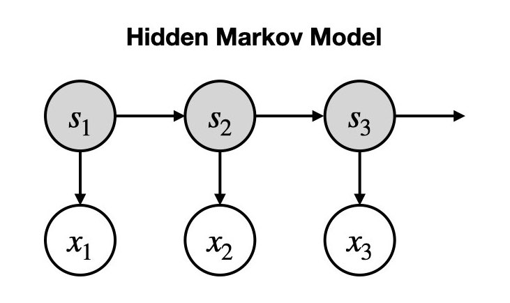

:orphan:

Hidden Markov Model (HMM)
=========================

Introduction
------------

The HMM is a popular model for studying time series data. The HMM has been used successfully to study neuroimaging data [1-8].

This model consists of two parts:

- A **hidden state** (also known as latent variable) whose dynamics are govern by a **transition probability matrix**.
- An **observation model**, which is the process of generating data given the hidden state.

Generative Model
^^^^^^^^^^^^^^^^

A generative model can be written down mathematically by specifying the joint distribution of observed and latent variables. The joint probability distribution for the HMM generating a sequence of data is

.. math::
    p(x_{1:T}, s_{1:T}) = p(x_1 | s_1) p(s_1) \prod^T_{t=2} p(x_t | s_t) p(s_t | s_{t-1}),

where :math:`x_{1:T}` denotes a sequence of observed data (:math:`x_1, x_2, ..., x_T`) and :math:`s_{1:T}` denotes a sequence of hidden states (:math:`s_1, s_2, ..., s_T`).

:math:`p(x_t | s_t)` is the probability distribution for the observed data given the hidden state. In this package, we use a multivariate normal distribution to specify this distribution.

.. math::
    p(x_t | s_t = k) = \mathcal{N}(m_k, C_k),

where :math:`m_k` and :math:`C_k` are state means and covariances and :math:`k` indexes the state that is active.

:math:`p(s_t | s_{t-1})` is the temporal model for the hidden state. Because the probability of the next state only depends on the current state (known as the **Markovian constraint**), this conditional probability distribution can be represented as a matrix.

The generative model is shown graphically below. The hidden states are the grey nodes and the observed data are white nodes. Arrows connect variables that are conditionally dependent.

Inference
^^^^^^^^^

The process of inference is to learn model parameters from observed data. In our case, the model parameters are:

- The hidden state at each time point, :math:`s_t`.
- The transition probability matrix, :math:`A_{ij} = p(s_t = i | s_{t-1} = j)`.
- The initial state probabilities, :math:`\pi_1 = p(s_1)`.
- The observation model parameters: state means, :math:`m_k`, and covariances, :math:`C_k`.

We use a Bayesian inference method called the **Expectation-Maximization (EM) algorithm** to learn these parameters. In short:

- We randomly initialize the model parameters.
- E-step: we use the current value of the model parameters :math:`\{ A_{ij}, \pi_1, m_k, C_k \}` to estimate the state probabilities :math:`q(s_t)` (**posterior**).
- M-step: we use the state probabilities :math:`q(s_t)` from the E-step to update the model parameters :math:`\{ A_{ij}, \pi_1, m_k, C_k \}`.

After we have trained the model, We take the most likely value from :math:`q(s_t)` as our estimate for the model parameters (this is known as the **MAP estimate**).

We do the above for small subsets of our entire training dataset (batches), which leads to noisy updates to the model parameters. Over time they converge to the best parameters for generating the observed data.

The process of inference is also known as 'training the model' or 'fitting a model'.

HMM in osl-dynamics
-------------------

This package contains a Python implementation of the HMM. In this implementation we perform Bayesian inference on the hidden states, :math:`s_t`, but learn point estimates (i.e. not Bayesian) for all the other parameters, this includes the transition probability matrix and state means and covariances. Given the transition probability matrix, state means and covariances are global parameters (the same for all time points), modelling their uncertainty is less valuable, whereas the uncertainty in the hidden state may be different at different time points.

A derivation of the cost function used to train the HMM in osl-dynamics is :download:`here <images/hmm-cost-function.pdf>`. Note, we use different symbols in this derivation compared to the previous section.

HMM-MAR Toolbox
---------------

Our group has previously implemented an HMM in MATLAB: `HMM-MAR <https://github.com/OHBA-analysis/HMM-MAR>`_. The model in HMM-MAR is fully Bayesian, i.e. it learns the uncertainty in all model parameters.

Post-hoc Analysis
-----------------

After we fit an HMM we're often interested in interpreting the hidden states. We typically do two types of analysis: studying statistics that summarise the hidden state time course (called summary statistics) and re-estimating spectral properties from the training data given the state time course. These are discussed below.

Summary Statistics
^^^^^^^^^^^^^^^^^^

It is common to look at four summary statistics:

- The **fractional occupancy**, which is the fraction of total that is spent in a particular state.
- The **mean lifetime**, which is the average duration of a state visit. This is called known as the 'dwell time'.
- The **mean interval**, which is the average duration between successive state visits.
- The **switching rate**, which is the average number of visits to a state (i.e. activations) per second.

Summary statistics can be calculated for individual subjects or for a group. See the :doc:`HMM Summary Statistics tutorial <../tutorials_build/hmm_summary_stats>` for example code of how to calculate these quantities.

Spectral Analysis
^^^^^^^^^^^^^^^^^

When we train using the time-delay embedding (see the :doc:`Data Preparation tutorial <../tutorials_build/data_prepare_meg>` for further details) we can learn spectrally distinct states. I.e. states that exhibit oscillatory activity at different frequencies. We can estimate the power spectral density (PSD) of each state using the unprepared training data (i.e. before time-delay emebdding) and the hidden state time course. We normally a **multitaper** approach for this. This involves a few steps:

- Multiple the (unprepared) training data by the hidden state time course (or state probability time course). This essentially picks out the time points that corresponds to when the state is activity.
- Split the time series into windows with no overlap. Typically we use twice the sampling frequency for the window length to give us a frequency resolution of 0.5 Hz.
- Multiply each window by a number of 'tapers' (hence the name 'multitaper') to give a number of tapered windows.
- For each tapered window, calculate the Fourier transform and square to give a PSD for the tapered window. Next, we average the PSD of each tapered window to give an estimate of the PSD of the window.
- Then, average over each window's PSD to give an estimate of the PSD of the entire time series.

The above is performed in the `analysis.spectral.multitaper_spectra <https://osl-dynamics.readthedocs.io/en/latest/autoapi/osl_dynamics/analysis/spectral/index.html#osl_dynamics.analysis.spectral.multitaper_spectra>`_ function in osl-dynamics.

We find high frequency activity (above ~25 Hz) sometimes leads to noisy estimates for coherence networks. To remove this noise, we often use a non-negative matrix factorization (NNMF) approach to separate different bands of oscillatory activity. These bands are sometimes referred to as 'spectral components'. The :doc:`HMM Plotting MEG Networks tutorial <../tutorials_build/hmm_plotting_meg_networks>` goes into this in more detail.

**When calculating power and coherence maps for HMM states the multitaper and NNMF approach is recommended.**

Fisher kernel
^^^^^^^^^^^^^

The Fisher kernel can be used to characterize the similarity between subjects given the generative model. This can be used for downstream supervised learning tasks using for example kernel ridge regression and kernel SVM (support vector machine). This gives a more principled way to perform predictions than using "handmade" features like the summary statistics and it has the advantage of tuning the importance of each parameter in the generative model automatically in a prediction task.

For a derivation of the Fisher kernel see :download:`here <images/hmm-fisher-kernel.pdf>`.

References
----------

#. D Vidaurre, et al., Discovering dynamic brain networks from big data in rest and task. `Neuroimage, 2018 <https://www.sciencedirect.com/science/article/pii/S1053811917305487>`_.
#. A Baker, et al., Fast transient networks in spontaneous human brain activity. `Elife, 2014 <https://elifesciences.org/articles/01867>`_.
#. D Vidaurre, et al., Brain Network Dynamics are Hierarchically Organised in Time. `PNAS, 2017 <https://www.pnas.org/doi/10.1073/pnas.1705120114>`_. 
#. D Vidaurre, et al., Spontaneous cortical activity transiently organises into frequency specific phase-coupling networks. `Nat. Commun. 2018 <https://www.nature.com/articles/s41467-018-05316-z>`_.
#. J van Schependom, et al., Reduced brain integrity slows down and increases low alpha power in multiple sclerosis. `Multiple Sclerosis Journal, 2020 <https://www.sciencedirect.com/science/article/pii/S2213158221000760?via%3Dihub>`_.
#. T Sitnikova, et al., Short timescale abnormalities in the states of spontaneous synchrony in the functional neural networks in Alzheimer's disease. `Neuroimage: Clinical, 2018 <https://www.sciencedirect.com/science/article/pii/S2213158218301748>`_.
#. A Quinn, et al., Task-evoked dynamic network analysis through hidden markov modelling. `Frontiers in Neuroscience, 2018 <https://www.frontiersin.org/articles/10.3389/fnins.2018.00603/full>`_.
#. C Higgins, et al., Replay bursts in humans coincide with activation of the default mode and parietal alpha networks. `Neuron, 2021 <https://www.sciencedirect.com/science/article/pii/S0896627320309661>`_.
