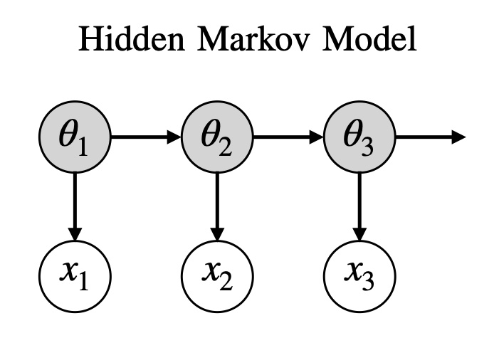

:orphan:

Hidden Markov Model (HMM)
=========================

Introduction
------------

The HMM is a popular model for studying time series data. The HMM has been used successfully to study neuroimaging data [1-7].

This model consists of two parts:

- A **hidden state** (also known as latent variable) whose dynamics are govern by a **transition probability matrix**.
- An **observation model**, which is the process of generating data given the hidden state.

Generative Model
^^^^^^^^^^^^^^^^

A generative model can be written down mathematically by specifying the joint distribution of observed and latent variables. The joint probability distribution for the HMM generating a sequence of data is

.. math::
    p(x_{1:T}, \theta_{1:T}) = p(x_1 | \theta_1) p(\theta_1) \prod^T_{t=2} p(x_t | \theta_t) p(\theta_t | \theta_{t-1}),

where :math:`x_{1:T}` denotes a sequence of observed data (:math:`x_1, x_2, ..., x_T`) and :math:`\theta_{1:T}` denotes a sequence of hidden states (:math:`\theta_1, \theta_2, ..., \theta_T`).

:math:`p(x_t | \theta_t)` is the probability distribution for the observed data given the hidden state. In this package, we use a multivariate normal distribution to specify this distribution.

.. math::
    p(x_t | \theta_t = k) = \mathcal{N}(m_k, C_k),

where :math:`m_k` and :math:`C_k` are state means and covariances and :math:`k` indexes the state that is active.

:math:`p(\theta_t | \theta_{t-1})` is the temporal model for the hidden state. Because the probability of the next state only depends on the current state (known as the **Markovian constraint**), this conditional probability distribution can be represented as a matrix.

The generative model is shown graphically below. The hidden states are the grey nodes and the observed data are white nodes. Arrows connect variables that are conditionally dependent.

Inference
^^^^^^^^^

The process of inference is to learn model parameters from observed data. In our case, the model parameters are:

- The transition probability matrix, :math:`p(\theta_t | \theta_{t-1})`.
- The hidden state at each time point, :math:`\theta_t`.
- The observation model parameters: state means, :math:`m_k`, and covariances, :math:`C_k`.

In addition, we want to learn the uncertainty in our estimates for the model parameters. We do this with 'Bayesian inference' by learning probability distributions for each model parameter. We use a method of Bayesian inference known as **variational Bayes**, which turns the problem of inference into an optimization task. In short, the way this process works is:

- We randomly initialize approximate distributions for model parameters (known as an **approximate posterior distribution**). I.e. we propose the distribution :math:`q(.)` for the model parameters.
- We use the generative model to calculate a cost function (**variational free energy**), which capture the likelihood of our current model parameters generating the data we have observed.
- We tweak the model parameters distributions :math:`q(.)` to minimise the cost function.
- We take the most likely value from :math:`q(.)` as our estimate for the model parameters (this is known as the **MAP estimate**).

We do the above for small subsets of our entire training dataset (batches), which leads to noisy updates to the model parameters. Over time they converge to the best parameters for generating the observed data. This process is known as **stochastic variational Bayes** and allows us to scale to large datasets.

The process of inference is also known as 'training the model' or 'fitting a model'.

HMM in osl-dynamics
-------------------

This package contains a Python implementation of the HMM. In this implementation we perform Bayesian inference on the hidden states, :math:`\theta_t`, but learn point estimates (i.e. not Bayesian) for the state means and covariances. Given the state means and covariances are global parameters (the same for all time points), modelling their uncertainty is less valuable, whereas the uncertainty in the hidden state may be different at different time points.

A derivation of the cost function used to train the HMM in osl-dynamics is :download:`here <images/hmm-cost-function.pdf>`. Note, we use different symbols in this derivation compared to the previous section.

HMM-MAR Toolbox
---------------

Our group has previously implemented an HMM in MATLAB: `HMM-MAR <https://github.com/OHBA-analysis/HMM-MAR>`_. The model in HMM-MAR is fully Bayesian, i.e. it learns the uncertainty in all model parameters.

References
----------

#. D Vidaurre, et al., Discovering dynamic brain networks from big data in rest and task. `Neuroimage, 2018 <https://www.sciencedirect.com/science/article/pii/S1053811917305487>`_.
#. A Baker, et al., Fast transient networks in spontaneous human brain activity. `Elife, 2014 <https://elifesciences.org/articles/01867>`_.
#. D Vidaurre, et al., Brain Network Dynamics are Hierarchically Organised in Time. `PNAS, 2017 <https://www.pnas.org/doi/10.1073/pnas.1705120114>`_. 
#. D Vidaurre, et al., Spontaneous cortical activity transiently organises into frequency specific phase-coupling networks. `Nat. Commun. 2018 <https://www.nature.com/articles/s41467-018-05316-z>`_.
#. J van Schependom, et al., Reduced brain integrity slows down and increases low alpha power in multiple sclerosis. `Multiple Sclerosis Journal, 2020 <https://www.sciencedirect.com/science/article/pii/S2213158221000760?via%3Dihub>`_.
#. T Sitnikova, et al., Short timescale abnormalities in the states of spontaneous synchrony in the functional neural networks in Alzheimer's disease. `Neuroimage: Clinical, 2018 <https://www.sciencedirect.com/science/article/pii/S2213158218301748>`_.
#. A Quinn, et al., Task-evoked dynamic network analysis through hidden markov modelling. `Frontiers in Neuroscience, 2018 <https://www.frontiersin.org/articles/10.3389/fnins.2018.00603/full>`_.
#. C Higgins, et al., Replay bursts in humans coincide with activation of the default mode and parietal alpha networks. `Neuron, 2021 <https://www.sciencedirect.com/science/article/pii/S0896627320309661>`_.
