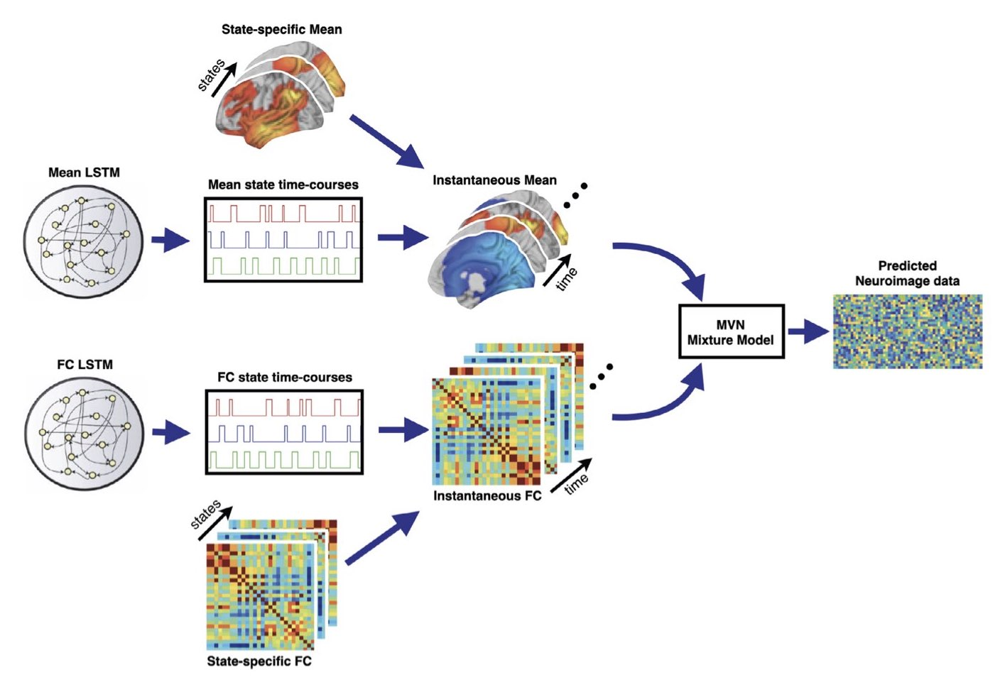

:orphan:

Multi-dynamic Adversarial Generator Encoder
===========================================

Introduction
------------

Functional connectivity (FC) in fMRI data shows little variation with time. This maybe due to limitations in the methods used to estimate time-varying FC. In particular, modelling the data with a single time course for dynamics. **Multi-dynamic Adversarial Generator Encoder** (MAGE) [1] proposes two separate dynamics for neuroimaging data: one for the mean activity (and variance) and another for the FC.

Generative Model
----------------

Mathematically, the generative model (joint probability distribution) is

.. math::
    p(x_{1:T}, \theta^m_{1:T}, \theta^C_{1:T}) = p(x_1 | \theta^m_1, \theta^C_1) p(\theta^m_1) p(\theta^C_1) \prod_{t=2}^T p(x_t | \theta^m_t, \theta^C_t) p(\theta^m_t | \theta^m_{1:t-1}) p(\theta^C_t | \theta^C_{1:t-1}),

where :math:`x_{1:T}` denotes a sequence of observed data (:math:`x_1, x_2, ..., x_T`) and :math:`\theta^{m,C}_{1:T}` is a sequence of latent variables (:math:`\theta^{m,C}_1, \theta^{m,C}_2, ..., \theta^{m,C}_T`), which we will call `logits` (because we feed them to a softmax transform, see below).

The observation model we use in MAGE is:

.. math::
    p(x_t | \theta^m_t, \theta^C_t) = \mathcal{N}(m_t, C_t)

Here, the time-vaying mean is a function of the first logit, :math:`m_t = f(\theta^m_t)`, and the time-varying covariance (which captures FC) is a function of both logits, :math:`C_t = f(\theta^m_t, \theta^C_t)`. Each logit has its own model for dynamics (separate Model RNNs):

.. math::
    p(\theta^m_t | \theta^m_{1:t-1}) = \mathcal{N}(m_{\theta^m_t}, \sigma^2_{\theta^m_t}), \\
    p(\theta^C_t | \theta^C_{1:t-1}) = \mathcal{N}(m_{\theta^C_t}, \sigma^2_{\theta^C_t})

with the parameters of each distribution (:math:`m_{\theta^m_t}, \sigma^2_{\theta^m_t}` and :math:`m_{\theta^C_t}, \sigma^2_{\theta^C_t}`) being predicted by separate LSTMs [2] using historic logits as input.

The time-varying mean and covariance is given by a linear mixture of static means, :math:`\mu_j`; variances, :math:`D_j`; and FC :math:`E_j`:

.. math::
    m_t = \displaystyle\sum_j \alpha^m_{jt} \mu_j \\
    C_t = G_t F_t G_t \\
    G_t = \displaystyle\sum_j \alpha^m_{jt} D_j \\
    F_t = \displaystyle\sum_j \alpha^C_{jt} E_j

with

.. math::
    \alpha^m_{jt} = \{ \mathrm{softmax}(\theta^m_t) \}_j \\
    \alpha^C_{jt} = \{ \mathrm{softmax}(\theta^C_t) \}_j

Notice we have tied the dynamics of the mean and variances together.

The generative model for MAGE is shown below.

Inference
---------

Other models in osl-dynamics use variational Bayes to infer model parameters. MAGE takes a different approach based on adversarial networks. See [1] for further details and the cost function used for training.

References
----------

#. U Pervaiz, et al., Multi-dynamic modelling reveals strongly time-varying resting fMRI correlations. `Medical Image Analysis, 2022 <https://www.sciencedirect.com/science/article/pii/S1361841522000196>`_.
