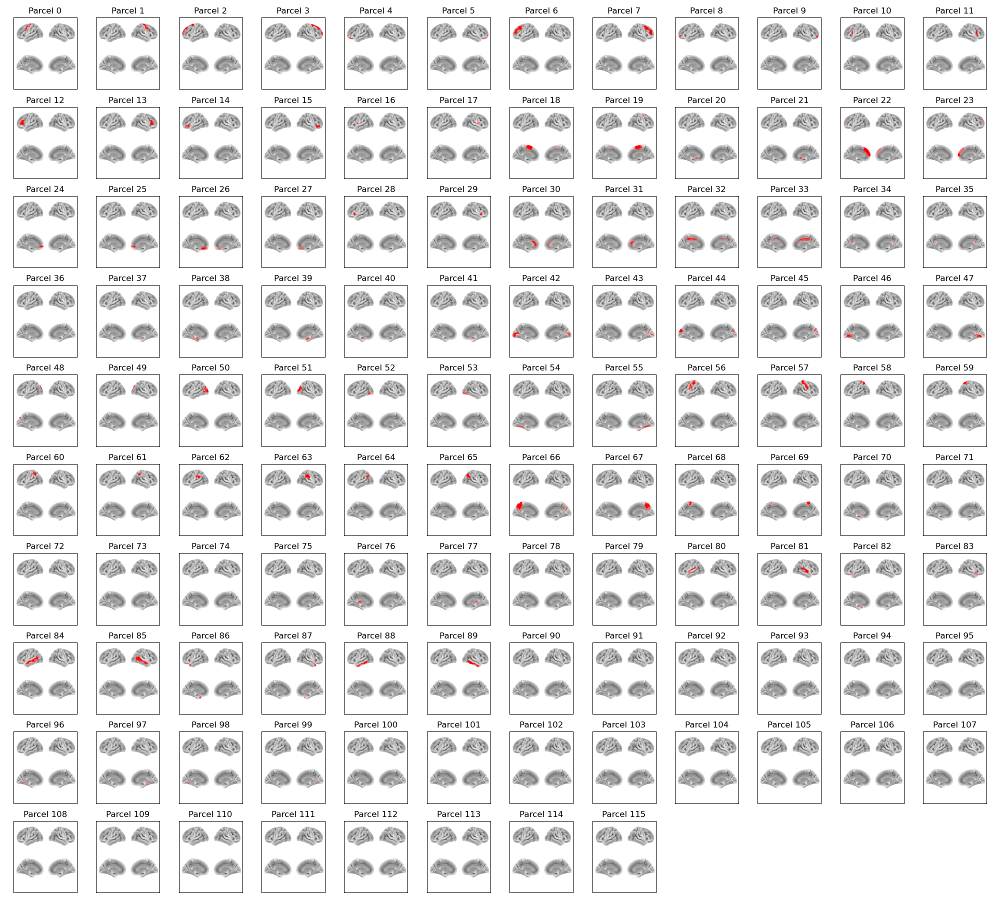

:orphan:

AAL116 Parcellation
===================

In osl-dynamics, this parcellation file is named :code:`atlas-AAL_nparc-116_space-MNI_res-8x8x8.nii.gz`.

This parcellation contains the **116 regions** (cortical, subcortical, and cerebellar) from the `Automated Anatomical Labelling <https://www.gin.cnrs.fr/en/tools/aal/>`_ atlas (AAL SPM12).

Parcels
-------

Labels and MNI coordinates:

+-------+---------------------------+------------+--------+--------+--------+
| Index | Parcel                    | Hemisphere | X      | Y      | Z      |
+=======+===========================+============+========+========+========+
| 0     | Precentral                | left       | -38.9  | -7.0   | 49.7   |
+-------+---------------------------+------------+--------+--------+--------+
| 1     | Precentral                | right      | 41.0   | -9.7   | 51.0   |
+-------+---------------------------+------------+--------+--------+--------+
| 2     | Frontal_Sup               | left       | -18.9  | 33.4   | 41.1   |
+-------+---------------------------+------------+--------+--------+--------+
| 3     | Frontal_Sup               | right      | 21.6   | 29.8   | 42.7   |
+-------+---------------------------+------------+--------+--------+--------+
| 4     | Frontal_Sup_Orb           | left       | -16.9  | 46.3   | -14.7  |
+-------+---------------------------+------------+--------+--------+--------+
| 5     | Frontal_Sup_Orb           | right      | 18.3   | 46.7   | -15.3  |
+-------+---------------------------+------------+--------+--------+--------+
| 6     | Frontal_Mid               | left       | -33.8  | 31.4   | 34.2   |
+-------+---------------------------+------------+--------+--------+--------+
| 7     | Frontal_Mid               | right      | 37.4   | 31.6   | 33.0   |
+-------+---------------------------+------------+--------+--------+--------+
| 8     | Frontal_Mid_Orb           | left       | -30.9  | 49.1   | -10.8  |
+-------+---------------------------+------------+--------+--------+--------+
| 9     | Frontal_Mid_Orb           | right      | 32.8   | 51.2   | -12.0  |
+-------+---------------------------+------------+--------+--------+--------+
| 10    | Frontal_Inf_Oper          | left       | -48.8  | 11.5   | 17.6   |
+-------+---------------------------+------------+--------+--------+--------+
| 11    | Frontal_Inf_Oper          | right      | 50.1   | 13.7   | 20.4   |
+-------+---------------------------+------------+--------+--------+--------+
| 12    | Frontal_Inf_Tri           | left       | -45.9  | 28.7   | 12.8   |
+-------+---------------------------+------------+--------+--------+--------+
| 13    | Frontal_Inf_Tri           | right      | 50.1   | 28.8   | 13.1   |
+-------+---------------------------+------------+--------+--------+--------+
| 14    | Frontal_Inf_Orb           | left       | -36.5  | 29.6   | -13.2  |
+-------+---------------------------+------------+--------+--------+--------+
| 15    | Frontal_Inf_Orb           | right      | 41.2   | 31.2   | -13.1  |
+-------+---------------------------+------------+--------+--------+--------+
| 16    | Rolandic_Oper             | left       | -47.4  | -9.7   | 12.6   |
+-------+---------------------------+------------+--------+--------+--------+
| 17    | Rolandic_Oper             | right      | 52.3   | -7.7   | 13.4   |
+-------+---------------------------+------------+--------+--------+--------+
| 18    | Supp_Motor_Area           | left       | -5.6   | 3.5    | 60.0   |
+-------+---------------------------+------------+--------+--------+--------+
| 19    | Supp_Motor_Area           | right      | 8.1    | -1.2   | 60.6   |
+-------+---------------------------+------------+--------+--------+--------+
| 20    | Olfactory                 | left       | -7.9   | 14.3   | -12.2  |
+-------+---------------------------+------------+--------+--------+--------+
| 21    | Olfactory                 | right      | 9.6    | 15.0   | -12.2  |
+-------+---------------------------+------------+--------+--------+--------+
| 22    | Frontal_Sup_Medial        | left       | -5.1   | 47.9   | 29.6   |
+-------+---------------------------+------------+--------+--------+--------+
| 23    | Frontal_Sup_Medial        | right      | 8.6    | 49.6   | 28.8   |
+-------+---------------------------+------------+--------+--------+--------+
| 24    | Frontal_Med_Orb           | left       | -5.4   | 52.5   | -8.9   |
+-------+---------------------------+------------+--------+--------+--------+
| 25    | Frontal_Med_Orb           | right      | 7.8    | 50.4   | -8.4   |
+-------+---------------------------+------------+--------+--------+--------+
| 26    | Rectus                    | left       | -5.4   | 35.5   | -19.4  |
+-------+---------------------------+------------+--------+--------+--------+
| 27    | Rectus                    | right      | 7.9    | 34.5   | -19.3  |
+-------+---------------------------+------------+--------+--------+--------+
| 28    | Insula                    | left       | -35.4  | 5.5    | 2.2    |
+-------+---------------------------+------------+--------+--------+--------+
| 29    | Insula                    | right      | 38.7   | 5.1    | 0.8    |
+-------+---------------------------+------------+--------+--------+--------+
| 30    | Cingulum_Ant              | left       | -4.2   | 34.2   | 12.7   |
+-------+---------------------------+------------+--------+--------+--------+
| 31    | Cingulum_Ant              | right      | 8.1    | 35.6   | 14.7   |
+-------+---------------------------+------------+--------+--------+--------+
| 32    | Cingulum_Mid              | left       | -5.8   | -16.0  | 40.0   |
+-------+---------------------------+------------+--------+--------+--------+
| 33    | Cingulum_Mid              | right      | 7.6    | -10.2  | 38.6   |
+-------+---------------------------+------------+--------+--------+--------+
| 34    | Cingulum_Post             | left       | -5.1   | -44.3  | 23.5   |
+-------+---------------------------+------------+--------+--------+--------+
| 35    | Cingulum_Post             | right      | 6.9    | -42.9  | 20.4   |
+-------+---------------------------+------------+--------+--------+--------+
| 36    | Hippocampus               | left       | -25.4  | -21.8  | -11.6  |
+-------+---------------------------+------------+--------+--------+--------+
| 37    | Hippocampus               | right      | 28.9   | -21.0  | -11.5  |
+-------+---------------------------+------------+--------+--------+--------+
| 38    | ParaHippocampal           | left       | -21.4  | -17.3  | -21.9  |
+-------+---------------------------+------------+--------+--------+--------+
| 39    | ParaHippocampal           | right      | 25.1   | -16.3  | -21.8  |
+-------+---------------------------+------------+--------+--------+--------+
| 40    | Amygdala                  | left       | -23.6  | -1.8   | -18.4  |
+-------+---------------------------+------------+--------+--------+--------+
| 41    | Amygdala                  | right      | 27.2   | -0.6   | -18.8  |
+-------+---------------------------+------------+--------+--------+--------+
| 42    | Calcarine                 | left       | -7.7   | -79.7  | 5.1    |
+-------+---------------------------+------------+--------+--------+--------+
| 43    | Calcarine                 | right      | 15.7   | -74.3  | 7.9    |
+-------+---------------------------+------------+--------+--------+--------+
| 44    | Cuneus                    | left       | -6.3   | -81.1  | 26.0   |
+-------+---------------------------+------------+--------+--------+--------+
| 45    | Cuneus                    | right      | 13.1   | -80.4  | 26.8   |
+-------+---------------------------+------------+--------+--------+--------+
| 46    | Lingual                   | left       | -14.8  | -68.7  | -5.9   |
+-------+---------------------------+------------+--------+--------+--------+
| 47    | Lingual                   | right      | 15.9   | -68.2  | -5.2   |
+-------+---------------------------+------------+--------+--------+--------+
| 48    | Occipital_Sup             | left       | -16.7  | -85.7  | 26.7   |
+-------+---------------------------+------------+--------+--------+--------+
| 49    | Occipital_Sup             | right      | 23.9   | -82.2  | 29.2   |
+-------+---------------------------+------------+--------+--------+--------+
| 50    | Occipital_Mid             | left       | -32.6  | -82.0  | 14.9   |
+-------+---------------------------+------------+--------+--------+--------+
| 51    | Occipital_Mid             | right      | 37.1   | -80.9  | 18.2   |
+-------+---------------------------+------------+--------+--------+--------+
| 52    | Occipital_Inf             | left       | -36.5  | -79.7  | -9.1   |
+-------+---------------------------+------------+--------+--------+--------+
| 53    | Occipital_Inf             | right      | 37.8   | -83.3  | -9.0   |
+-------+---------------------------+------------+--------+--------+--------+
| 54    | Fusiform                  | left       | -31.4  | -41.1  | -21.6  |
+-------+---------------------------+------------+--------+--------+--------+
| 55    | Fusiform                  | right      | 33.6   | -40.0  | -21.6  |
+-------+---------------------------+------------+--------+--------+--------+
| 56    | Postcentral               | left       | -42.9  | -23.8  | 47.5   |
+-------+---------------------------+------------+--------+--------+--------+
| 57    | Postcentral               | right      | 41.1   | -26.8  | 51.4   |
+-------+---------------------------+------------+--------+--------+--------+
| 58    | Parietal_Sup              | left       | -23.7  | -60.9  | 57.7   |
+-------+---------------------------+------------+--------+--------+--------+
| 59    | Parietal_Sup              | right      | 25.9   | -60.5  | 60.7   |
+-------+---------------------------+------------+--------+--------+--------+
| 60    | Parietal_Inf              | left       | -43.2  | -46.9  | 45.4   |
+-------+---------------------------+------------+--------+--------+--------+
| 61    | Parietal_Inf              | right      | 46.2   | -47.6  | 48.4   |
+-------+---------------------------+------------+--------+--------+--------+
| 62    | SupraMarginal             | left       | -56.2  | -34.8  | 28.8   |
+-------+---------------------------+------------+--------+--------+--------+
| 63    | SupraMarginal             | right      | 57.2   | -32.7  | 33.0   |
+-------+---------------------------+------------+--------+--------+--------+
| 64    | Angular                   | left       | -44.4  | -62.1  | 34.3   |
+-------+---------------------------+------------+--------+--------+--------+
| 65    | Angular                   | right      | 45.3   | -61.2  | 37.4   |
+-------+---------------------------+------------+--------+--------+--------+
| 66    | Precuneus                 | left       | -7.5   | -57.3  | 46.6   |
+-------+---------------------------+------------+--------+--------+--------+
| 67    | Precuneus                 | right      | 9.6    | -57.3  | 42.4   |
+-------+---------------------------+------------+--------+--------+--------+
| 68    | Paracentral_Lobule        | left       | -7.9   | -26.7  | 68.5   |
+-------+---------------------------+------------+--------+--------+--------+
| 69    | Paracentral_Lobule        | right      | 7.1    | -33.1  | 66.6   |
+-------+---------------------------+------------+--------+--------+--------+
| 70    | Caudate                   | left       | -11.8  | 9.6    | 8.2    |
+-------+---------------------------+------------+--------+--------+--------+
| 71    | Caudate                   | right      | 14.5   | 11.0   | 8.2    |
+-------+---------------------------+------------+--------+--------+--------+
| 72    | Putamen                   | left       | -24.3  | 2.6    | 1.3    |
+-------+---------------------------+------------+--------+--------+--------+
| 73    | Putamen                   | right      | 27.6   | 3.6    | 1.3    |
+-------+---------------------------+------------+--------+--------+--------+
| 74    | Pallidum                  | left       | -18.0  | -1.3   | -1.2   |
+-------+---------------------------+------------+--------+--------+--------+
| 75    | Pallidum                  | right      | 20.9   | -1.0   | -1.1   |
+-------+---------------------------+------------+--------+--------+--------+
| 76    | Thalamus                  | left       | -11.3  | -18.8  | 6.8    |
+-------+---------------------------+------------+--------+--------+--------+
| 77    | Thalamus                  | right      | 12.6   | -18.8  | 6.9    |
+-------+---------------------------+------------+--------+--------+--------+
| 78    | Heschl                    | left       | -42.1  | -20.1  | 8.6    |
+-------+---------------------------+------------+--------+--------+--------+
| 79    | Heschl                    | right      | 45.7   | -18.1  | 9.4    |
+-------+---------------------------+------------+--------+--------+--------+
| 80    | Temporal_Sup              | left       | -53.4  | -22.2  | 5.9    |
+-------+---------------------------+------------+--------+--------+--------+
| 81    | Temporal_Sup              | right      | 57.8   | -23.0  | 5.5    |
+-------+---------------------------+------------+--------+--------+--------+
| 82    | Temporal_Pole_Sup         | left       | -40.2  | 13.8   | -21.3  |
+-------+---------------------------+------------+--------+--------+--------+
| 83    | Temporal_Pole_Sup         | right      | 47.8   | 13.5   | -18.3  |
+-------+---------------------------+------------+--------+--------+--------+
| 84    | Temporal_Mid              | left       | -55.8  | -35.1  | -3.6   |
+-------+---------------------------+------------+--------+--------+--------+
| 85    | Temporal_Mid              | right      | 57.2   | -38.5  | -2.8   |
+-------+---------------------------+------------+--------+--------+--------+
| 86    | Temporal_Pole_Mid         | left       | -36.5  | 13.3   | -35.4  |
+-------+---------------------------+------------+--------+--------+--------+
| 87    | Temporal_Pole_Mid         | right      | 44.0   | 13.3   | -33.4  |
+-------+---------------------------+------------+--------+--------+--------+
| 88    | Temporal_Inf              | left       | -50.1  | -29.2  | -24.6  |
+-------+---------------------------+------------+--------+--------+--------+
| 89    | Temporal_Inf              | right      | 53.4   | -32.2  | -23.7  |
+-------+---------------------------+------------+--------+--------+--------+
| 90    | Cerebelum_Crus1           | left       | -35.3  | -68.1  | -30.2  |
+-------+---------------------------+------------+--------+--------+--------+
| 91    | Cerebelum_Crus1           | right      | 38.2   | -68.3  | -30.9  |
+-------+---------------------------+------------+--------+--------+--------+
| 92    | Cerebelum_Crus2           | left       | -27.8  | -74.5  | -39.5  |
+-------+---------------------------+------------+--------+--------+--------+
| 93    | Cerebelum_Crus2           | right      | 32.5   | -70.6  | -41.2  |
+-------+---------------------------+------------+--------+--------+--------+
| 94    | Cerebelum_3               | left       | -8.5   | -38.3  | -19.9  |
+-------+---------------------------+------------+--------+--------+--------+
| 95    | Cerebelum_3               | right      | 13.3   | -35.5  | -20.7  |
+-------+---------------------------+------------+--------+--------+--------+
| 96    | Cerebelum_4_5             | left       | -14.6  | -44.5  | -18.5  |
+-------+---------------------------+------------+--------+--------+--------+
| 97    | Cerebelum_4_5             | right      | 18.2   | -44.0  | -19.5  |
+-------+---------------------------+------------+--------+--------+--------+
| 98    | Cerebelum_6               | left       | -22.8  | -60.2  | -23.6  |
+-------+---------------------------+------------+--------+--------+--------+
| 99    | Cerebelum_6               | right      | 25.6   | -59.6  | -25.0  |
+-------+---------------------------+------------+--------+--------+--------+
| 100   | Cerebelum_7b              | left       | -31.4  | -61.5  | -46.8  |
+-------+---------------------------+------------+--------+--------+--------+
| 101   | Cerebelum_7b              | right      | 33.8   | -64.4  | -49.8  |
+-------+---------------------------+------------+--------+--------+--------+
| 102   | Cerebelum_8               | left       | -25.3  | -55.7  | -49.1  |
+-------+---------------------------+------------+--------+--------+--------+
| 103   | Cerebelum_8               | right      | 25.9   | -57.5  | -50.8  |
+-------+---------------------------+------------+--------+--------+--------+
| 104   | Cerebelum_9               | left       | -10.3  | -50.2  | -47.1  |
+-------+---------------------------+------------+--------+--------+--------+
| 105   | Cerebelum_9               | right      | 10.1   | -50.8  | -47.6  |
+-------+---------------------------+------------+--------+--------+--------+
| 106   | Cerebelum_10              | left       | -21.8  | -34.9  | -42.8  |
+-------+---------------------------+------------+--------+--------+--------+
| 107   | Cerebelum_10              | right      | 26.8   | -35.1  | -42.6  |
+-------+---------------------------+------------+--------+--------+--------+
| 108   | Vermis_1_2                | midline    | 1.4    | -40.3  | -21.8  |
+-------+---------------------------+------------+--------+--------+--------+
| 109   | Vermis_3                  | midline    | 2.1    | -41.4  | -12.8  |
+-------+---------------------------+------------+--------+--------+--------+
| 110   | Vermis_4_5                | midline    | 1.8    | -53.5  | -7.5   |
+-------+---------------------------+------------+--------+--------+--------+
| 111   | Vermis_6                  | midline    | 1.8    | -68.5  | -16.5  |
+-------+---------------------------+------------+--------+--------+--------+
| 112   | Vermis_7                  | midline    | 1.8    | -73.0  | -26.2  |
+-------+---------------------------+------------+--------+--------+--------+
| 113   | Vermis_8                  | midline    | 1.8    | -65.5  | -35.4  |
+-------+---------------------------+------------+--------+--------+--------+
| 114   | Vermis_9                  | midline    | 1.7    | -56.5  | -36.5  |
+-------+---------------------------+------------+--------+--------+--------+
| 115   | Vermis_10                 | midline    | 1.0    | -47.4  | -32.8  |
+-------+---------------------------+------------+--------+--------+--------+

Example Code
------------

Example code for plotting with this parcellation:

.. code::

    from osl_dynamics.analysis import power

    power.save(
        ...,
        mask_file="MNI152_T1_8mm_brain.nii.gz",
        parcellation_file="atlas-AAL_nparc-116_space-MNI_res-8x8x8.nii.gz",
        filename="map_.png",
    )

Reference
---------

If you use this parcellation, please cite:

    Tzourio-Mazoyer, N., Landeau, B., Papathanassiou, D., Crivello, F., Etard, O., Delcroix, N., Mazoyer, B., & Joliot, M. (2002). Automated Anatomical Labeling of Activations in SPM Using a Macroscopic Anatomical Parcellation of the MNI MRI Single-Subject Brain. *NeuroImage*, 15(1), 273-289. https://doi.org/10.1006/nimg.2001.0978
