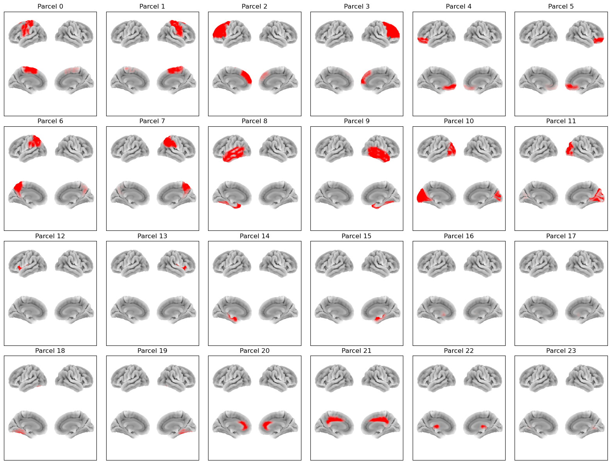

:orphan:

AAL24 Parcellation
==================

In osl-dynamics, this parcellation file is named :code:`atlas-AAL_nparc-24_space-MNI_res-8x8x8.nii.gz`.

This is a reduced version of the :doc:`AAL116 parcellation <aal116>`, obtained by merging the original `Automated Anatomical Labelling <https://www.gin.cnrs.fr/en/tools/aal/>`_ regions into 24 broad anatomical groups (10 bilateral pairs plus 4 midline regions).

Parcels
-------

Labels and MNI coordinates:

+-------+----------------------+------------+--------+--------+--------+
| Index | Parcel               | Hemisphere | X      | Y      | Z      |
+=======+======================+============+========+========+========+
| 0     | Sensorimotor         | left       | -31.3  | -13.0  | 50.0   |
+-------+----------------------+------------+--------+--------+--------+
| 1     | Sensorimotor         | right      | 33.2   | -14.9  | 49.9   |
+-------+----------------------+------------+--------+--------+--------+
| 2     | Lateral Frontal      | left       | -27.6  | 33.4   | 30.2   |
+-------+----------------------+------------+--------+--------+--------+
| 3     | Lateral Frontal      | right      | 32.0   | 31.6   | 31.0   |
+-------+----------------------+------------+--------+--------+--------+
| 4     | Orbitofrontal        | left       | -21.5  | 39.0   | -13.4  |
+-------+----------------------+------------+--------+--------+--------+
| 5     | Orbitofrontal        | right      | 24.5   | 40.1   | -13.3  |
+-------+----------------------+------------+--------+--------+--------+
| 6     | Parietal             | left       | -28.9  | -53.5  | 45.1   |
+-------+----------------------+------------+--------+--------+--------+
| 7     | Parietal             | right      | 32.6   | -52.8  | 44.4   |
+-------+----------------------+------------+--------+--------+--------+
| 8     | Lateral Temporal     | left       | -48.0  | -25.9  | -12.3  |
+-------+----------------------+------------+--------+--------+--------+
| 9     | Lateral Temporal     | right      | 51.0   | -26.1  | -11.9  |
+-------+----------------------+------------+--------+--------+--------+
| 10    | Occipital            | left       | -19.4  | -79.2  | 10.0   |
+-------+----------------------+------------+--------+--------+--------+
| 11    | Occipital            | right      | 23.1   | -77.2  | 11.1   |
+-------+----------------------+------------+--------+--------+--------+
| 12    | Insula               | left       | -35.4  | 5.5    | 2.2    |
+-------+----------------------+------------+--------+--------+--------+
| 13    | Insula               | right      | 38.7   | 5.1    | 0.8    |
+-------+----------------------+------------+--------+--------+--------+
| 14    | Medial Temporal      | left       | -23.4  | -17.6  | -17.1  |
+-------+----------------------+------------+--------+--------+--------+
| 15    | Medial Temporal      | right      | 26.9   | -16.5  | -17.3  |
+-------+----------------------+------------+--------+--------+--------+
| 16    | Basal Ganglia        | left       | -18.1  | 5.1    | 3.9    |
+-------+----------------------+------------+--------+--------+--------+
| 17    | Basal Ganglia        | right      | 21.2   | 6.2    | 3.9    |
+-------+----------------------+------------+--------+--------+--------+
| 18    | Cerebellum (lateral) | left       | -25.5  | -60.9  | -35.1  |
+-------+----------------------+------------+--------+--------+--------+
| 19    | Cerebellum (lateral) | right      | 28.4   | -60.9  | -37.1  |
+-------+----------------------+------------+--------+--------+--------+
| 20    | Anterior Cingulate   | midline    | 1.8    | 34.9   | 13.7   |
+-------+----------------------+------------+--------+--------+--------+
| 21    | Middle Cingulate     | midline    | 1.0    | -18.0  | 36.5   |
+-------+----------------------+------------+--------+--------+--------+
| 22    | Thalamus             | midline    | 0.5    | -18.8  | 6.8    |
+-------+----------------------+------------+--------+--------+--------+
| 23    | Cerebellar Vermis    | midline    | 1.8    | -57.8  | -18.9  |
+-------+----------------------+------------+--------+--------+--------+

Each AAL24 parcel was formed by merging the following AAL116 regions:

+----------------------+------------------------------------------------------------------------------------------+
| Parcel               | AAL116 regions                                                                           |
+======================+==========================================================================================+
| Sensorimotor         | Precentral, Postcentral, Supp_Motor_Area, Paracentral_Lobule, Rolandic_Oper              |
+----------------------+------------------------------------------------------------------------------------------+
| Lateral Frontal      | Frontal_Sup, Frontal_Mid, Frontal_Inf_Oper, Frontal_Inf_Tri, Frontal_Sup_Medial          |
+----------------------+------------------------------------------------------------------------------------------+
| Orbitofrontal        | Frontal_Sup_Orb, Frontal_Mid_Orb, Frontal_Inf_Orb, Frontal_Med_Orb, Rectus, Olfactory    |
+----------------------+------------------------------------------------------------------------------------------+
| Parietal             | Parietal_Sup, Parietal_Inf, Precuneus, SupraMarginal, Angular                            |
+----------------------+------------------------------------------------------------------------------------------+
| Lateral Temporal     | Temporal_Sup, Temporal_Mid, Temporal_Inf, Temporal_Pole_Sup, Temporal_Pole_Mid,          |
|                      | Fusiform, Heschl                                                                         |
+----------------------+------------------------------------------------------------------------------------------+
| Occipital            | Occipital_Sup, Occipital_Mid, Occipital_Inf, Calcarine, Cuneus, Lingual                  |
+----------------------+------------------------------------------------------------------------------------------+
| Insula               | Insula                                                                                   |
+----------------------+------------------------------------------------------------------------------------------+
| Medial Temporal      | Hippocampus, ParaHippocampal, Amygdala                                                   |
+----------------------+------------------------------------------------------------------------------------------+
| Basal Ganglia        | Caudate, Putamen, Pallidum                                                               |
+----------------------+------------------------------------------------------------------------------------------+
| Cerebellum (lateral) | Cerebelum_Crus1, Cerebelum_Crus2, Cerebelum_3, Cerebelum_4_5, Cerebelum_6, Cerebelum_7b, |
|                      | Cerebelum_8, Cerebelum_9                                                                 |
+----------------------+------------------------------------------------------------------------------------------+
| Anterior Cingulate   | Cingulum_Ant                                                                             |
+----------------------+------------------------------------------------------------------------------------------+
| Middle Cingulate     | Cingulum_Mid, Cingulum_Post                                                              |
+----------------------+------------------------------------------------------------------------------------------+
| Thalamus             | Thalamus                                                                                 |
+----------------------+------------------------------------------------------------------------------------------+
| Cerebellar Vermis    | Vermis_3, Vermis_4_5, Vermis_6, Vermis_7, Vermis_8, Vermis_9, Vermis_10                  |
+----------------------+------------------------------------------------------------------------------------------+

Example Code
------------

Example code for plotting with this parcellation:

.. code::

    from osl_dynamics.analysis import power

    power.save(
        ...,
        mask_file="MNI152_T1_8mm_brain.nii.gz",
        parcellation_file="atlas-AAL_nparc-24_space-MNI_res-8x8x8.nii.gz",
        filename="map_.png",
    )

Reference
---------

If you use this parcellation, please cite:

    Tzourio-Mazoyer, N., Landeau, B., Papathanassiou, D., Crivello, F., Etard, O., Delcroix, N., Mazoyer, B., & Joliot, M. (2002). Automated Anatomical Labeling of Activations in SPM Using a Macroscopic Anatomical Parcellation of the MNI MRI Single-Subject Brain. *NeuroImage*, 15(1), 273-289. https://doi.org/10.1006/nimg.2001.0978
