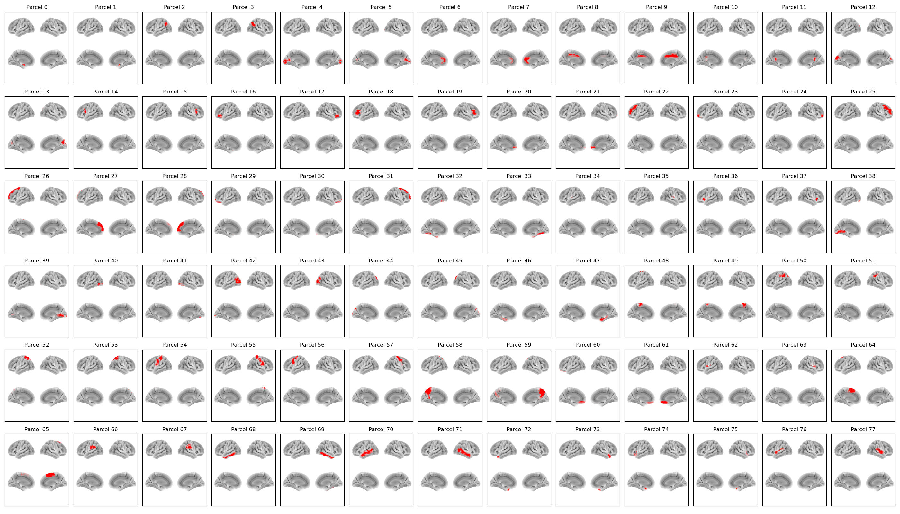

:orphan:

AAL78 Parcellation
==================

In osl-dynamics, this parcellation file is named :code:`atlas-AAL_nparc-78_space-MNI_res-8x8x8.nii.gz`, however, this parcellation file was previously named :code:`aal_cortical_merged_8mm_stacked.nii.gz` (both names will work).

This parcellation contains the **cortical regions** from the `Automated Anatomical Labelling <https://www.gin.cnrs.fr/en/tools/aal/>`_ atlas.

Parcels
-------

Example Code
------------

Example code for plotting with this parcellation:

.. code::

    from osl_dynamics.analysis import power

    power.save(
        ...,
        mask_file="MNI152_T1_8mm_brain.nii.gz",
        parcellation_file="atlas-AAL_nparc-78_space-MNI_res-8x8x8.nii.gz",
        filename="map_.png",
    )
