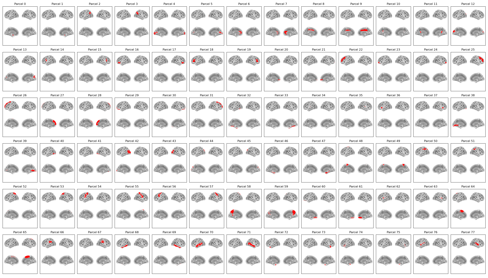

:orphan:

AAL78 Parcellation
==================

In osl-dynamics, this parcellation file is named :code:`atlas-AAL_nparc-78_space-MNI_res-8x8x8.nii.gz`, however, this parcellation file was previously named :code:`aal_cortical_merged_8mm_stacked.nii.gz` (both names will work).

This parcellation contains the **cortical regions** from the `Automated Anatomical Labelling <https://www.gin.cnrs.fr/en/tools/aal/>`_ atlas.

Parcels
-------

Labels and MNI coordinates:

+-------+---------------------------+------------+--------+--------+--------+
| Index | Parcel                    | Hemisphere | X      | Y      | Z      |
+=======+===========================+============+========+========+========+
| 0     | Amygdala                  | left       | -23.3  | 0.7    | -18.7  |
+-------+---------------------------+------------+--------+--------+--------+
| 1     | Amygdala                  | right      | 26.0   | 2.0    | -20.0  |
+-------+---------------------------+------------+--------+--------+--------+
| 2     | Angular                   | left       | -47.3  | -58.4  | 32.9   |
+-------+---------------------------+------------+--------+--------+--------+
| 3     | Angular                   | right      | 43.4   | -58.6  | 36.3   |
+-------+---------------------------+------------+--------+--------+--------+
| 4     | Calcarine                 | left       | -7.7   | -78.9  | 4.9    |
+-------+---------------------------+------------+--------+--------+--------+
| 5     | Calcarine                 | right      | 14.0   | -71.7  | 9.1    |
+-------+---------------------------+------------+--------+--------+--------+
| 6     | Cingulum_Ant              | left       | -7.3   | 37.6   | 11.1   |
+-------+---------------------------+------------+--------+--------+--------+
| 7     | Cingulum_Ant              | right      | 5.0    | 38.0   | 13.3   |
+-------+---------------------------+------------+--------+--------+--------+
| 8     | Cingulum_Mid              | left       | -9.2   | -12.8  | 39.5   |
+-------+---------------------------+------------+--------+--------+--------+
| 9     | Cingulum_Mid              | right      | 5.2    | -8.5   | 37.9   |
+-------+---------------------------+------------+--------+--------+--------+
| 10    | Cingulum_Post             | left       | -6.0   | -39.1  | 24.0   |
+-------+---------------------------+------------+--------+--------+--------+
| 11    | Cingulum_Post             | right      | 5.4    | -40.3  | 17.1   |
+-------+---------------------------+------------+--------+--------+--------+
| 12    | Cuneus                    | left       | -8.1   | -80.1  | 24.0   |
+-------+---------------------------+------------+--------+--------+--------+
| 13    | Cuneus                    | right      | 11.1   | -79.8  | 25.1   |
+-------+---------------------------+------------+--------+--------+--------+
| 14    | Frontal_Inf_Oper          | left       | -48.5  | 13.0   | 19.0   |
+-------+---------------------------+------------+--------+--------+--------+
| 15    | Frontal_Inf_Oper          | right      | 47.5   | 15.0   | 16.5   |
+-------+---------------------------+------------+--------+--------+--------+
| 16    | Frontal_Inf_Orb           | left       | -36.3  | 30.3   | -14.3  |
+-------+---------------------------+------------+--------+--------+--------+
| 17    | Frontal_Inf_Orb           | right      | 37.6   | 31.5   | -14.2  |
+-------+---------------------------+------------+--------+--------+--------+
| 18    | Frontal_Inf_Tri           | left       | -46.3  | 29.4   | 11.6   |
+-------+---------------------------+------------+--------+--------+--------+
| 19    | Frontal_Inf_Tri           | right      | 47.4   | 30.2   | 12.5   |
+-------+---------------------------+------------+--------+--------+--------+
| 20    | Frontal_Med_Orb           | left       | -8.7   | 51.3   | -8.0   |
+-------+---------------------------+------------+--------+--------+--------+
| 21    | Frontal_Med_Orb           | right      | 5.6    | 55.3   | -8.9   |
+-------+---------------------------+------------+--------+--------+--------+
| 22    | Frontal_Mid               | left       | -34.7  | 33.2   | 33.1   |
+-------+---------------------------+------------+--------+--------+--------+
| 23    | Frontal_Mid_Orb           | left       | -30.0  | 49.4   | -12.3  |
+-------+---------------------------+------------+--------+--------+--------+
| 24    | Frontal_Mid_Orb           | right      | 32.4   | 53.2   | -12.8  |
+-------+---------------------------+------------+--------+--------+--------+
| 25    | Frontal_Mid               | right      | 35.5   | 33.4   | 33.3   |
+-------+---------------------------+------------+--------+--------+--------+
| 26    | Frontal_Sup               | left       | -19.9  | 35.1   | 39.9   |
+-------+---------------------------+------------+--------+--------+--------+
| 27    | Frontal_Sup_Medial        | left       | -8.2   | 50.8   | 25.5   |
+-------+---------------------------+------------+--------+--------+--------+
| 28    | Frontal_Sup_Medial        | right      | 6.2    | 51.7   | 28.2   |
+-------+---------------------------+------------+--------+--------+--------+
| 29    | Frontal_Sup_Orb           | left       | -17.1  | 49.4   | -16.6  |
+-------+---------------------------+------------+--------+--------+--------+
| 30    | Frontal_Sup_Orb           | right      | 14.7   | 44.4   | -18.4  |
+-------+---------------------------+------------+--------+--------+--------+
| 31    | Frontal_Sup               | right      | 20.4   | 31.8   | 40.8   |
+-------+---------------------------+------------+--------+--------+--------+
| 32    | Fusiform                  | left       | -34.3  | -39.4  | -21.9  |
+-------+---------------------------+------------+--------+--------+--------+
| 33    | Fusiform                  | right      | 32.6   | -38.7  | -21.5  |
+-------+---------------------------+------------+--------+--------+--------+
| 34    | Heschl                    | left       | -46.0  | -16.7  | 8.0    |
+-------+---------------------------+------------+--------+--------+--------+
| 35    | Heschl                    | right      | 42.0   | -18.0  | 10.7   |
+-------+---------------------------+------------+--------+--------+--------+
| 36    | Insula                    | left       | -37.5  | 9.7    | 0.8    |
+-------+---------------------------+------------+--------+--------+--------+
| 37    | Insula                    | right      | 36.5   | 9.3    | 1.1    |
+-------+---------------------------+------------+--------+--------+--------+
| 38    | Lingual                   | left       | -16.9  | -69.1  | -8.0   |
+-------+---------------------------+------------+--------+--------+--------+
| 39    | Lingual                   | right      | 13.9   | -68.3  | -4.3   |
+-------+---------------------------+------------+--------+--------+--------+
| 40    | Occipital_Inf             | left       | -37.5  | -79.1  | -9.6   |
+-------+---------------------------+------------+--------+--------+--------+
| 41    | Occipital_Inf             | right      | 35.1   | -79.6  | -11.2  |
+-------+---------------------------+------------+--------+--------+--------+
| 42    | Occipital_Mid             | left       | -33.9  | -80.8  | 14.1   |
+-------+---------------------------+------------+--------+--------+--------+
| 43    | Occipital_Mid             | right      | 35.1   | -79.9  | 16.4   |
+-------+---------------------------+------------+--------+--------+--------+
| 44    | Occipital_Sup             | left       | -17.8  | -83.0  | 27.8   |
+-------+---------------------------+------------+--------+--------+--------+
| 45    | Occipital_Sup             | right      | 23.2   | -80.4  | 31.5   |
+-------+---------------------------+------------+--------+--------+--------+
| 46    | ParaHippocampal           | left       | -24.7  | -14.5  | -23.5  |
+-------+---------------------------+------------+--------+--------+--------+
| 47    | ParaHippocampal           | right      | 23.2   | -13.2  | -22.4  |
+-------+---------------------------+------------+--------+--------+--------+
| 48    | Paracentral_Lobule        | left       | -9.7   | -23.6  | 66.7   |
+-------+---------------------------+------------+--------+--------+--------+
| 49    | Paracentral_Lobule        | right      | 6.0    | -31.3  | 63.3   |
+-------+---------------------------+------------+--------+--------+--------+
| 50    | Parietal_Inf              | left       | -44.9  | -47.3  | 45.5   |
+-------+---------------------------+------------+--------+--------+--------+
| 51    | Parietal_Inf              | right      | 46.9   | -46.0  | 48.3   |
+-------+---------------------------+------------+--------+--------+--------+
| 52    | Parietal_Sup              | left       | -26.1  | -58.6  | 56.5   |
+-------+---------------------------+------------+--------+--------+--------+
| 53    | Parietal_Sup              | right      | 24.8   | -59.0  | 58.4   |
+-------+---------------------------+------------+--------+--------+--------+
| 54    | Postcentral               | left       | -43.7  | -23.0  | 46.8   |
+-------+---------------------------+------------+--------+--------+--------+
| 55    | Postcentral               | right      | 39.2   | -24.9  | 50.6   |
+-------+---------------------------+------------+--------+--------+--------+
| 56    | Precentral                | left       | -40.9  | -4.5   | 47.7   |
+-------+---------------------------+------------+--------+--------+--------+
| 57    | Precentral                | right      | 39.4   | -7.1   | 50.1   |
+-------+---------------------------+------------+--------+--------+--------+
| 58    | Precuneus                 | left       | -10.1  | -55.2  | 45.7   |
+-------+---------------------------+------------+--------+--------+--------+
| 59    | Precuneus                 | right      | 7.7    | -57.0  | 41.7   |
+-------+---------------------------+------------+--------+--------+--------+
| 60    | Rectus                    | left       | -8.4   | 39.6   | -18.8  |
+-------+---------------------------+------------+--------+--------+--------+
| 61    | Rectus                    | right      | 5.3    | 36.8   | -18.8  |
+-------+---------------------------+------------+--------+--------+--------+
| 62    | Rolandic_Oper             | left       | -48.0  | -9.3   | 12.7   |
+-------+---------------------------+------------+--------+--------+--------+
| 63    | Rolandic_Oper             | right      | 50.5   | -3.9   | 11.7   |
+-------+---------------------------+------------+--------+--------+--------+
| 64    | Supp_Motor_Area           | left       | -7.9   | 6.8    | 58.6   |
+-------+---------------------------+------------+--------+--------+--------+
| 65    | Supp_Motor_Area           | right      | 6.4    | 2.0    | 59.1   |
+-------+---------------------------+------------+--------+--------+--------+
| 66    | SupraMarginal             | left       | -57.5  | -33.1  | 27.5   |
+-------+---------------------------+------------+--------+--------+--------+
| 67    | SupraMarginal             | right      | 54.9   | -29.5  | 32.0   |
+-------+---------------------------+------------+--------+--------+--------+
| 68    | Temporal_Inf              | left       | -51.1  | -30.4  | -22.8  |
+-------+---------------------------+------------+--------+--------+--------+
| 69    | Temporal_Inf              | right      | 51.1   | -30.8  | -23.2  |
+-------+---------------------------+------------+--------+--------+--------+
| 70    | Temporal_Mid              | left       | -56.9  | -31.6  | -4.1   |
+-------+---------------------------+------------+--------+--------+--------+
| 71    | Temporal_Mid              | right      | 55.1   | -37.5  | -2.5   |
+-------+---------------------------+------------+--------+--------+--------+
| 72    | Temporal_Pole_Mid         | left       | -36.4  | 14.0   | -36.0  |
+-------+---------------------------+------------+--------+--------+--------+
| 73    | Temporal_Pole_Mid         | right      | 41.4   | 13.4   | -32.0  |
+-------+---------------------------+------------+--------+--------+--------+
| 74    | Temporal_Pole_Sup         | left       | -40.4  | 13.8   | -21.2  |
+-------+---------------------------+------------+--------+--------+--------+
| 75    | Temporal_Pole_Sup         | right      | 41.5   | 15.5   | -21.0  |
+-------+---------------------------+------------+--------+--------+--------+
| 76    | Temporal_Sup              | left       | -53.4  | -17.7  | 3.7    |
+-------+---------------------------+------------+--------+--------+--------+
| 77    | Temporal_Sup              | right      | 55.4   | -19.6  | 4.7    |
+-------+---------------------------+------------+--------+--------+--------+

Example Code
------------

Example code for plotting with this parcellation:

.. code::

    from osl_dynamics.analysis import power

    power.save(
        ...,
        parcellation_file="atlas-AAL_nparc-78_space-MNI_res-8x8x8.nii.gz",
        filename="map_.png",
    )

Reference
---------

If you use this parcellation, please cite:

    Tzourio-Mazoyer, N., Landeau, B., Papathanassiou, D., Crivello, F., Etard, O., Delcroix, N., Mazoyer, B., & Joliot, M. (2002). Automated Anatomical Labeling of Activations in SPM Using a Macroscopic Anatomical Parcellation of the MNI MRI Single-Subject Brain. *NeuroImage*, 15(1), 273-289. https://doi.org/10.1006/nimg.2001.0978
