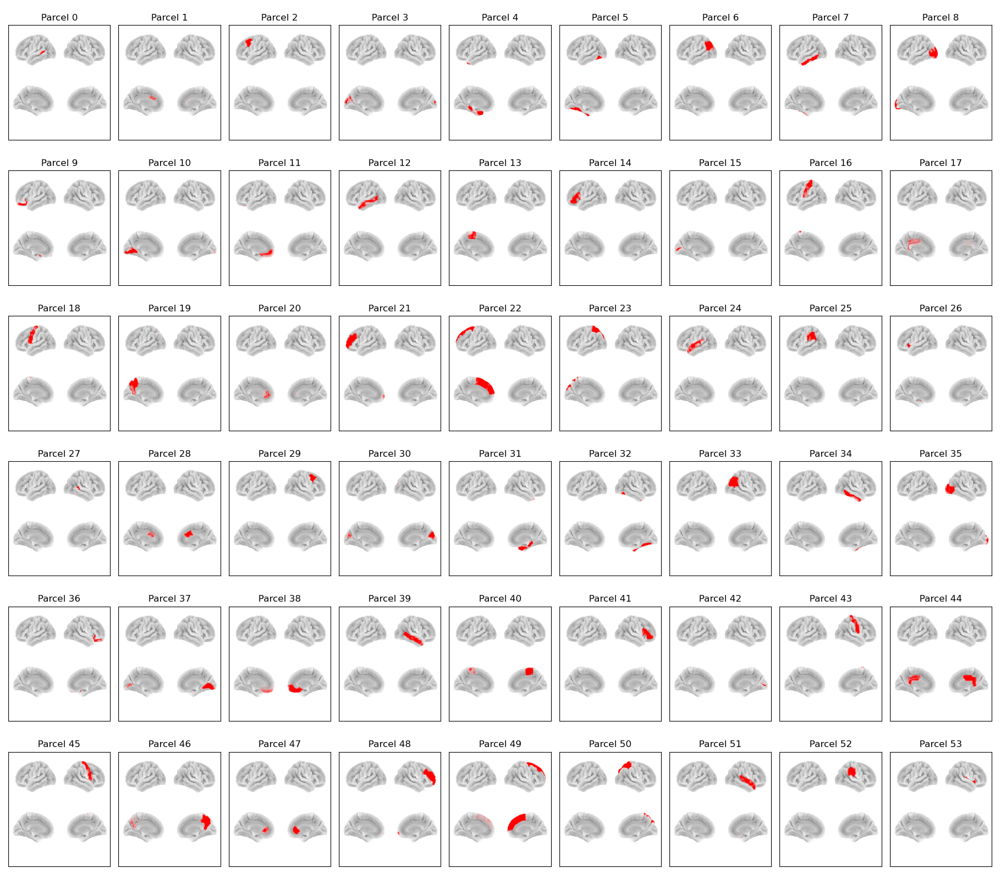

:orphan:

DK54 Parcellation
=================

This is a reduced version of the original (cortical only) :doc:`DK68 parcellation <dk68>`.

Parcels
-------

Labels and MNI coordinates:

+-------+------------------------------------------------------------------+------------+-------+-------+-------+
| Index | Parcel                                                           | Hemisphere | X     | Y     | Z     |
+=======+==================================================================+============+=======+=======+=======+
| 0     | Banks of Superior Temporal Sulcus                                | left       | -50.3 | -44.4 | 6.4   |
| 1     | Caudal Anterior Cingulate                                        | left       | -9.1  | 16.2  | 25.2  |
| 2     | Caudal Middle Frontal                                            | left       | -34.7 | 10.9  | 44.0  |
| 3     | Cuneus                                                           | left       | -6.0  | -83.7 | 17.7  |
| 4     | Entorhinal + Parahippocampal + Temporal Pole                     | left       | -24.6 | -5.5  | -29.7 |
| 5     | Fusiform Gyrus                                                   | left       | -33.2 | -43.9 | -21.5 |
| 6     | Inferior Parietal Cortex                                         | left       | -40.4 | -66.0 | 30.2  |
| 7     | Inferior Temporal Cortex                                         | left       | -50.4 | -35.1 | -22.2 |
| 8     | Lateral Occipital Cortex                                         | left       | -28.3 | -89.0 | 1.1   |
| 9     | Lateral Orbitofrontal Cortex                                     | left       | -23.6 | 30.7  | -15.5 |
| 10    | Lingual Gyrus                                                    | left       | -13.8 | -67.3 | -5.1  |
| 11    | Medial Orbitofrontal Cortex                                      | left       | -7.6  | 38.0  | -14.8 |
| 12    | Middle Temporal Cortex                                           | left       | -56.9 | -27.7 | -11.9 |
| 13    | Paracentral Lobule                                               | left       | -9.6  | -27.5 | 54.5  |
| 14    | Inferior Frontal Gyrus (Pars Opercularis/Orbitalis/Triangularis) | left       | -43.6 | 26.6  | 5.2   |
| 15    | Pericalcarine Cortex                                             | left       | -15.1 | -79.7 | 6.3   |
| 16    | Postcentral Gyrus                                                | left       | -41.6 | -25.0 | 47.6  |
| 17    | Posterior + Isthmus Cingulate                                    | left       | -8.9  | -27.1 | 28.6  |
| 18    | Precentral Gyrus                                                 | left       | -38.6 | -8.7  | 41.2  |
| 19    | Precuneus                                                        | left       | -11.6 | -58.4 | 34.7  |
| 20    | Rostral Anterior Cingulate                                       | left       | -8.0  | 36.5  | 3.0   |
| 21    | Rostral Middle Frontal + Frontal Pole                            | left       | -29.7 | 46.3  | 15.2  |
| 22    | Superior Frontal Cortex                                          | left       | -12.4 | 25.7  | 43.9  |
| 23    | Superior Parietal Cortex                                         | left       | -21.5 | -62.9 | 48.3  |
| 24    | Superior + Transverse Temporal Cortex                            | left       | -49.8 | -13.5 | -2.6  |
| 25    | Supramarginal Gyrus                                              | left       | -52.2 | -36.9 | 33.1  |
| 26    | Insula                                                           | left       | -33.7 | -4.0  | 3.4   |
| 27    | Banks of Superior Temporal Sulcus                                | right      | 49.3  | -40.9 | 7.3   |
| 28    | Caudal Anterior Cingulate                                        | right      | 6.0   | 18.4  | 25.6  |
| 29    | Caudal Middle Frontal                                            | right      | 35.9  | 10.8  | 44.4  |
| 30    | Cuneus                                                           | right      | 6.6   | -80.9 | 21.1  |
| 31    | Entorhinal + Parahippocampal + Temporal Pole                     | right      | 24.9  | -7.1  | -28.1 |
| 32    | Fusiform Gyrus                                                   | right      | 35.6  | -41.6 | -22.1 |
| 33    | Inferior Parietal Cortex                                         | right      | 44.1  | -60.8 | 30.3  |
| 34    | Inferior Temporal Cortex                                         | right      | 51.2  | -32.1 | -23.3 |
| 35    | Lateral Occipital Cortex                                         | right      | 31.7  | -85.4 | 1.4   |
| 36    | Lateral Orbitofrontal Cortex                                     | right      | 25.1  | 31.6  | -14.5 |
| 37    | Lingual Gyrus                                                    | right      | 14.8  | -65.5 | -4.4  |
| 38    | Medial Orbitofrontal Cortex                                      | right      | 5.8   | 36.7  | -14.7 |
| 39    | Middle Temporal Cortex                                           | right      | 58.3  | -26.1 | -12.4 |
| 40    | Paracentral Lobule                                               | right      | 8.6   | -25.5 | 55.3  |
| 41    | Inferior Frontal Gyrus (Pars Opercularis/Orbitalis/Triangularis) | right      | 46.8  | 27.4  | 5.0   |
| 42    | Pericalcarine Cortex                                             | right      | 15.2  | -78.5 | 7.5   |
| 43    | Postcentral Gyrus                                                | right      | 44.5  | -19.1 | 43.1  |
| 44    | Posterior + Isthmus Cingulate                                    | right      | 7.0   | -27.7 | 26.5  |
| 45    | Precentral Gyrus                                                 | right      | 38.5  | -8.9  | 44.6  |
| 46    | Precuneus                                                        | right      | 10.8  | -56.9 | 36.1  |
| 47    | Rostral Anterior Cingulate                                       | right      | 6.0   | 33.2  | 3.6   |
| 48    | Rostral Middle Frontal + Frontal Pole                            | right      | 31.3  | 46.2  | 16.2  |
| 49    | Superior Frontal Cortex                                          | right      | 11.5  | 26.8  | 43.4  |
| 50    | Superior Parietal Cortex                                         | right      | 24.6  | -59.1 | 51.3  |
| 51    | Superior + Transverse Temporal Cortex                            | right      | 52.5  | -7.8  | -6.0  |
| 52    | Supramarginal Gyrus                                              | right      | 52.6  | -31.8 | 31.9  |
| 53    | Insula                                                           | right      | 35.1  | -1.0  | 5.0   |
+-------+------------------------------------------------------------------+------------+-------+-------+-------+

Example Code
------------

Example code for plotting with this parcellation:

.. code::

    from osl_dynamics.analysis import power

    power.save(
        ...,
        mask_file="MNI152_T1_8mm_brain.nii.gz",
        parcellation_file="atlas-DK_nparc-54_space-MNI_res-8x8x8.nii.gz",
        filename="map_.png",
    )
