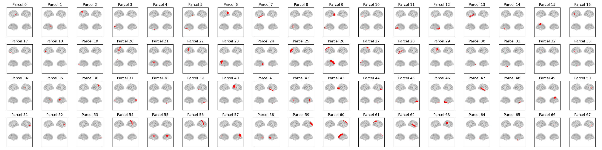

:orphan:

DK68 Parcellation
=================

This parcellation contains a volumetric version of the `Desikan-Killiany (DK) <https://surfer.nmr.mgh.harvard.edu/fswiki/CorticalParcellation>`_ atlas, which is the default atlas used in `FreeSurfer <https://surfer.nmr.mgh.harvard.edu/>`_.

Parcels
-------

Labels and MNI coordinates:

+-------+--------------------------------------------+------------+-------+-------+-------+
| Index | Parcel                                     | Hemisphere | X     | Y     | Z     |
+=======+============================================+============+=======+=======+=======+
| 0     | Banks of Superior Temporal Sulcus          | left       | -50.3 | -44.4 | 6.4   |
+-------+--------------------------------------------+------------+-------+-------+-------+
| 1     | Caudal Anterior Cingulate                  | left       | -9.1  | 16.2  | 25.2  |
+-------+--------------------------------------------+------------+-------+-------+-------+
| 2     | Caudal Middle Frontal                      | left       | -34.7 | 10.9  | 44.0  |
+-------+--------------------------------------------+------------+-------+-------+-------+
| 3     | Cuneus                                     | left       | -6.0  | -83.7 | 17.7  |
+-------+--------------------------------------------+------------+-------+-------+-------+
| 4     | Entorhinal Cortex                          | left       | -24.3 | -4.9  | -32.0 |
+-------+--------------------------------------------+------------+-------+-------+-------+
| 5     | Fusiform Gyrus                             | left       | -33.2 | -43.9 | -21.5 |
+-------+--------------------------------------------+------------+-------+-------+-------+
| 6     | Inferior Parietal Cortex                   | left       | -40.4 | -66.0 | 30.2  |
+-------+--------------------------------------------+------------+-------+-------+-------+
| 7     | Inferior Temporal Cortex                   | left       | -50.4 | -35.1 | -22.2 |
+-------+--------------------------------------------+------------+-------+-------+-------+
| 8     | Isthmus Cingulate                          | left       | -9.7  | -42.3 | 20.3  |
+-------+--------------------------------------------+------------+-------+-------+-------+
| 9     | Lateral Occipital Cortex                   | left       | -28.3 | -89.0 | 1.1   |
+-------+--------------------------------------------+------------+-------+-------+-------+
| 10    | Lateral Orbitofrontal Cortex               | left       | -23.6 | 30.7  | -15.5 |
+-------+--------------------------------------------+------------+-------+-------+-------+
| 11    | Lingual Gyrus                              | left       | -13.8 | -67.3 | -5.1  |
+-------+--------------------------------------------+------------+-------+-------+-------+
| 12    | Medial Orbitofrontal Cortex                | left       | -7.6  | 38.0  | -14.8 |
+-------+--------------------------------------------+------------+-------+-------+-------+
| 13    | Middle Temporal Cortex                     | left       | -56.9 | -27.7 | -11.9 |
+-------+--------------------------------------------+------------+-------+-------+-------+
| 14    | Parahippocampal Gyrus                      | left       | -19.6 | -30.8 | -18.4 |
+-------+--------------------------------------------+------------+-------+-------+-------+
| 15    | Paracentral Lobule                         | left       | -9.6  | -27.5 | 54.5  |
+-------+--------------------------------------------+------------+-------+-------+-------+
| 16    | Pars Opercularis                           | left       | -45.7 | 17.7  | 13.5  |
+-------+--------------------------------------------+------------+-------+-------+-------+
| 17    | Pars Orbitalis                             | left       | -42.0 | 38.0  | -12.8 |
+-------+--------------------------------------------+------------+-------+-------+-------+
| 18    | Pars Triangularis                          | left       | -41.8 | 32.1  | 3.4   |
+-------+--------------------------------------------+------------+-------+-------+-------+
| 19    | Pericalcarine Cortex                       | left       | -15.1 | -79.7 | 6.3   |
+-------+--------------------------------------------+------------+-------+-------+-------+
| 20    | Postcentral Gyrus                          | left       | -41.6 | -25.0 | 47.6  |
+-------+--------------------------------------------+------------+-------+-------+-------+
| 21    | Posterior Cingulate Cortex                 | left       | -8.4  | -17.2 | 34.0  |
+-------+--------------------------------------------+------------+-------+-------+-------+
| 22    | Precentral Gyrus                           | left       | -38.6 | -8.7  | 41.2  |
+-------+--------------------------------------------+------------+-------+-------+-------+
| 23    | Precuneus                                  | left       | -11.6 | -58.4 | 34.7  |
+-------+--------------------------------------------+------------+-------+-------+-------+
| 24    | Rostral Anterior Cingulate                 | left       | -8.0  | 36.5  | 3.0   |
+-------+--------------------------------------------+------------+-------+-------+-------+
| 25    | Rostral Middle Frontal                     | left       | -30.9 | 45.2  | 16.4  |
+-------+--------------------------------------------+------------+-------+-------+-------+
| 26    | Superior Frontal Cortex                    | left       | -12.4 | 25.7  | 43.9  |
+-------+--------------------------------------------+------------+-------+-------+-------+
| 27    | Superior Parietal Cortex                   | left       | -21.5 | -62.9 | 48.3  |
+-------+--------------------------------------------+------------+-------+-------+-------+
| 28    | Superior Temporal Cortex                   | left       | -50.7 | -12.3 | -3.9  |
+-------+--------------------------------------------+------------+-------+-------+-------+
| 29    | Supramarginal Gyrus                        | left       | -52.2 | -36.9 | 33.1  |
+-------+--------------------------------------------+------------+-------+-------+-------+
| 30    | Frontal Pole                               | left       | -9.2  | 66.0  | -6.4  |
+-------+--------------------------------------------+------------+-------+-------+-------+
| 31    | Temporal Pole                              | left       | -28.3 | 12.3  | -36.6 |
+-------+--------------------------------------------+------------+-------+-------+-------+
| 32    | Transverse Temporal Cortex                 | left       | -42.6 | -23.1 | 8.0   |
+-------+--------------------------------------------+------------+-------+-------+-------+
| 33    | Insula                                     | left       | -33.7 | -4.0  | 3.4   |
+-------+--------------------------------------------+------------+-------+-------+-------+
| 34    | Banks of Superior Temporal Sulcus          | right      | 49.3  | -40.9 | 7.3   |
+-------+--------------------------------------------+------------+-------+-------+-------+
| 35    | Caudal Anterior Cingulate                  | right      | 6.0   | 18.4  | 25.6  |
+-------+--------------------------------------------+------------+-------+-------+-------+
| 36    | Caudal Middle Frontal                      | right      | 35.9  | 10.8  | 44.4  |
+-------+--------------------------------------------+------------+-------+-------+-------+
| 37    | Cuneus                                     | right      | 6.6   | -80.9 | 21.1  |
+-------+--------------------------------------------+------------+-------+-------+-------+
| 38    | Entorhinal Cortex                          | right      | 23.1  | -3.8  | -33.5 |
+-------+--------------------------------------------+------------+-------+-------+-------+
| 39    | Fusiform Gyrus                             | right      | 35.6  | -41.6 | -22.1 |
+-------+--------------------------------------------+------------+-------+-------+-------+
| 40    | Inferior Parietal Cortex                   | right      | 44.1  | -60.8 | 30.3  |
+-------+--------------------------------------------+------------+-------+-------+-------+
| 41    | Inferior Temporal Cortex                   | right      | 51.2  | -32.1 | -23.3 |
+-------+--------------------------------------------+------------+-------+-------+-------+
| 42    | Isthmus Cingulate                          | right      | 7.2   | -41.6 | 17.6  |
+-------+--------------------------------------------+------------+-------+-------+-------+
| 43    | Lateral Occipital Cortex                   | right      | 31.7  | -85.4 | 1.4   |
+-------+--------------------------------------------+------------+-------+-------+-------+
| 44    | Lateral Orbitofrontal Cortex               | right      | 25.1  | 31.6  | -14.5 |
+-------+--------------------------------------------+------------+-------+-------+-------+
| 45    | Lingual Gyrus                              | right      | 14.8  | -65.5 | -4.4  |
+-------+--------------------------------------------+------------+-------+-------+-------+
| 46    | Medial Orbitofrontal Cortex                | right      | 5.8   | 36.7  | -14.7 |
+-------+--------------------------------------------+------------+-------+-------+-------+
| 47    | Middle Temporal Cortex                     | right      | 58.3  | -26.1 | -12.4 |
+-------+--------------------------------------------+------------+-------+-------+-------+
| 48    | Parahippocampal Gyrus                      | right      | 21.7  | -30.6 | -16.6 |
+-------+--------------------------------------------+------------+-------+-------+-------+
| 49    | Paracentral Lobule                         | right      | 8.6   | -25.5 | 55.3  |
+-------+--------------------------------------------+------------+-------+-------+-------+
| 50    | Pars Opercularis                           | right      | 47.6  | 14.9  | 14.3  |
+-------+--------------------------------------------+------------+-------+-------+-------+
| 51    | Pars Orbitalis                             | right      | 44.3  | 41.4  | -11.4 |
+-------+--------------------------------------------+------------+-------+-------+-------+
| 52    | Pars Triangularis                          | right      | 47.7  | 31.7  | 5.7   |
+-------+--------------------------------------------+------------+-------+-------+-------+
| 53    | Pericalcarine Cortex                       | right      | 15.2  | -78.5 | 7.5   |
+-------+--------------------------------------------+------------+-------+-------+-------+
| 54    | Postcentral Gyrus                          | right      | 44.5  | -19.1 | 43.1  |
+-------+--------------------------------------------+------------+-------+-------+-------+
| 55    | Posterior Cingulate Cortex                 | right      | 6.8   | -16.6 | 33.6  |
+-------+--------------------------------------------+------------+-------+-------+-------+
| 56    | Precentral Gyrus                           | right      | 38.5  | -8.9  | 44.6  |
+-------+--------------------------------------------+------------+-------+-------+-------+
| 57    | Precuneus                                  | right      | 10.8  | -56.9 | 36.1  |
+-------+--------------------------------------------+------------+-------+-------+-------+
| 58    | Rostral Anterior Cingulate                 | right      | 6.0   | 33.2  | 3.6   |
+-------+--------------------------------------------+------------+-------+-------+-------+
| 59    | Rostral Middle Frontal                     | right      | 32.3  | 45.4  | 17.3  |
+-------+--------------------------------------------+------------+-------+-------+-------+
| 60    | Superior Frontal Cortex                    | right      | 11.5  | 26.8  | 43.4  |
+-------+--------------------------------------------+------------+-------+-------+-------+
| 61    | Superior Parietal Cortex                   | right      | 24.6  | -59.1 | 51.3  |
+-------+--------------------------------------------+------------+-------+-------+-------+
| 62    | Superior Temporal Cortex                   | right      | 52.9  | -6.9  | -7.0  |
+-------+--------------------------------------------+------------+-------+-------+-------+
| 63    | Supramarginal Gyrus                        | right      | 52.6  | -31.8 | 31.9  |
+-------+--------------------------------------------+------------+-------+-------+-------+
| 64    | Frontal Pole                               | right      | 6.0   | 66.0  | -12.0 |
+-------+--------------------------------------------+------------+-------+-------+-------+
| 65    | Temporal Pole                              | right      | 29.7  | 13.7  | -35.1 |
+-------+--------------------------------------------+------------+-------+-------+-------+
| 66    | Transverse Temporal Cortex                 | right      | 46.0  | -22.0 | 8.0   |
+-------+--------------------------------------------+------------+-------+-------+-------+
| 67    | Insula                                     | right      | 35.1  | -1.0  | 5.0   |
+-------+--------------------------------------------+------------+-------+-------+-------+

Example Code
------------

Example code for plotting with this parcellation:

.. code::

    from osl_dynamics.analysis import power

    power.save(
        ...,
        mask_file="MNI152_T1_8mm_brain.nii.gz",
        parcellation_file="atlas-DK_nparc-68_space-MNI_res-8x8x8.nii.gz",
        filename="map_.png",
    )
