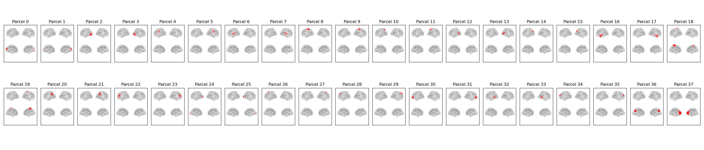

:orphan:

Giles38 Parcellation
====================

In osl-dynamics, this parcellation file is named :code:`atlas-Giles_nparc-38_space-MNI_res-8x8x8.nii.gz`, however, this parcellation file was previously named :code:`fmri_d100_parcellation_with_PCC_reduced_2mm_ss5mm_ds8mm.nii.gz` (both names will work).

This is the original parcellation created by Giles Colclough based on applying ICA to fMRI data from 100 subjects.

Parcels
-------

Example Code
------------

Example code for plotting with this parcellation:

.. code::

    from osl_dynamics.analysis import power

    power.save(
        ...,
        mask_file="MNI152_T1_8mm_brain.nii.gz",
        parcellation_file="atlas-Giles_nparc-38_space-MNI_res-8x8x8.nii.gz",
        filename="map_.png",
    )
