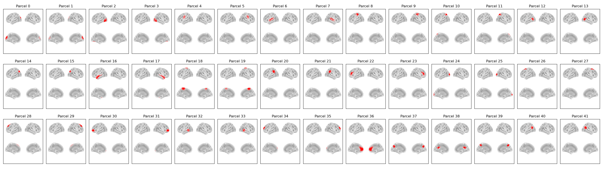

:orphan:

Giles42 Parcellation
====================

In osl-dynamics, this parcellation file is named :code:`atlas-Giles_nparc-42_space-MNI_res-8x8x8.nii.gz`, however, this parcellation file was previously named :code:`fmri_d100_parcellation_with_3PCC_ips_reduced_2mm_ss5mm_ds8mm_adj.nii.gz` (both names will work).

This is a modified version of the :doc:`original Giles parcellation <giles38>` to include the PCC plus 2 other parcels near it.

This parcellation was used in `Vidaurre et al. (2018) <https://www.nature.com/articles/s41467-018-05316-z>`_.

Parcels
-------

Labels and MNI coordinates:

+-------+-------------------------------------------------------------+------------+-------+--------+-------+
| Index | Parcel                                                      | Hemisphere | X     | Y      | Z     |
+=======+=============================================================+============+=======+========+=======+
| 0     | Primary / Early Visual Cortex (dorsal)                      | left       | -10.0 | -87.4  | 23.3  |
+-------+-------------------------------------------------------------+------------+-------+--------+-------+
| 1     | Primary / Early Visual Cortex (dorsal)                      | right      | 10.2  | -86.7  | 23.2  |
+-------+-------------------------------------------------------------+------------+-------+--------+-------+
| 2     | Ventral Visual / Fusiform                                   | left       | -37.4 | -76.7  | -5.0  |
+-------+-------------------------------------------------------------+------------+-------+--------+-------+
| 3     | Ventral Visual / Fusiform                                   | right      | 37.4  | -76.7  | -5.0  |
+-------+-------------------------------------------------------------+------------+-------+--------+-------+
| 4     | Inferior Frontal Cortex (ventrolateral / IFG)               | left       | -53.0 | -9.8   | 29.4  |
+-------+-------------------------------------------------------------+------------+-------+--------+-------+
| 5     | Inferior Frontal Cortex (ventrolateral / IFG)               | right      | 53.7  | -9.8   | 29.4  |
+-------+-------------------------------------------------------------+------------+-------+--------+-------+
| 6     | Lateral / Inferior Temporal Cortex                          | left       | -53.8 | -22.1  | 6.3   |
+-------+-------------------------------------------------------------+------------+-------+--------+-------+
| 7     | Lateral / Inferior Temporal Cortex                          | right      | 54.8  | -22.4  | 6.5   |
+-------+-------------------------------------------------------------+------------+-------+--------+-------+
| 8     | Superior Parietal / Dorsal Parietal                         | left       | -38.0 | -26.3  | 56.7  |
+-------+-------------------------------------------------------------+------------+-------+--------+-------+
| 9     | Superior Parietal / Dorsal Parietal                         | right      | 38.0  | -26.1  | 57.0  |
+-------+-------------------------------------------------------------+------------+-------+--------+-------+
| 10    | Precuneus / Superior Medial Parietal                        | left       | -23.1 | -60.8  | 53.6  |
+-------+-------------------------------------------------------------+------------+-------+--------+-------+
| 11    | Precuneus / Superior Medial Parietal                        | right      | 23.2  | -60.5  | 53.6  |
+-------+-------------------------------------------------------------+------------+-------+--------+-------+
| 12    | Lateral Occipital Cortex                                    | left       | -47.2 | -66.9  | 9.1   |
+-------+-------------------------------------------------------------+------------+-------+--------+-------+
| 13    | Lateral Occipital Cortex                                    | right      | 46.8  | -67.0  | 9.0   |
+-------+-------------------------------------------------------------+------------+-------+--------+-------+
| 14    | Intraparietal / Temporal-Parieto-Occipital junction (TPOJ)  | left       | -36.4 | -74.5  | 37.4  |
+-------+-------------------------------------------------------------+------------+-------+--------+-------+
| 15    | Intraparietal / Temporal-Parieto-Occipital junction (TPOJ)  | right      | 36.5  | -74.2  | 37.6  |
+-------+-------------------------------------------------------------+------------+-------+--------+-------+
| 16    | Anterior Ventral Temporal / Temporal Pole                   | left       | -50.7 | -5.5   | -16.6 |
+-------+-------------------------------------------------------------+------------+-------+--------+-------+
| 17    | Anterior Ventral Temporal / Temporal Pole                   | right      | 51.0  | -5.1   | -16.8 |
+-------+-------------------------------------------------------------+------------+-------+--------+-------+
| 18    | Supplementary Motor Area / Medial Motor                     | left       | -10.7 | -29.1  | 64.6  |
+-------+-------------------------------------------------------------+------------+-------+--------+-------+
| 19    | Supplementary Motor Area / Medial Motor                     | right      | 10.9  | -29.2  | 64.9  |
+-------+-------------------------------------------------------------+------------+-------+--------+-------+
| 20    | Inferior Parietal (angular / supramarginal)                 | left       | -55.6 | -47.0  | 33.6  |
+-------+-------------------------------------------------------------+------------+-------+--------+-------+
| 21    | Inferior Parietal (angular / supramarginal)                 | right      | 55.8  | -46.9  | 33.7  |
+-------+-------------------------------------------------------------+------------+-------+--------+-------+
| 22    | Ventrolateral PFC / Inferior Frontal (mid-lateral)          | left       | -42.4 | 29.5   | 11.9  |
+-------+-------------------------------------------------------------+------------+-------+--------+-------+
| 23    | Ventrolateral PFC / Inferior Frontal (mid-lateral)          | right      | 42.8  | 29.9   | 12.0  |
+-------+-------------------------------------------------------------+------------+-------+--------+-------+
| 24    | Occipital pole / Primary Visual Cortex (ventral)            | left       | -19.9 | -94.4  | 6.5   |
+-------+-------------------------------------------------------------+------------+-------+--------+-------+
| 25    | Occipital pole / Primary Visual Cortex (ventral)            | right      | 20.9  | -93.6  | 6.6   |
+-------+-------------------------------------------------------------+------------+-------+--------+-------+
| 26    | Dorsomedial / Superior Frontal (dorsomedial PFC)            | left       | -22.9 | 10.0   | 56.1  |
+-------+-------------------------------------------------------------+------------+-------+--------+-------+
| 27    | Dorsomedial / Superior Frontal (dorsomedial PFC)            | right      | 23.0  | 10.0   | 56.1  |
+-------+-------------------------------------------------------------+------------+-------+--------+-------+
| 28    | Superior Dorsolateral Prefrontal Cortex (dlPFC / SFG)       | left       | -14.7 | 36.9   | 46.9  |
+-------+-------------------------------------------------------------+------------+-------+--------+-------+
| 29    | Superior Dorsolateral Prefrontal Cortex (dlPFC / SFG)       | right      | 14.6  | 37.4   | 46.7  |
+-------+-------------------------------------------------------------+------------+-------+--------+-------+
| 30    | Orbital / Polar Frontal Cortex                              | left       | -31.9 | 52.2   | -4.9  |
+-------+-------------------------------------------------------------+------------+-------+--------+-------+
| 31    | Orbital / Polar Frontal Cortex                              | right      | 32.7  | 51.9   | -5.1  |
+-------+-------------------------------------------------------------+------------+-------+--------+-------+
| 32    | Temporo-parietal junction / posterior STS                   | left       | -57.7 | -47.6  | -1.4  |
+-------+-------------------------------------------------------------+------------+-------+--------+-------+
| 33    | Temporo-parietal junction / posterior STS                   | right      | 58.3  | -47.3  | -1.3  |
+-------+-------------------------------------------------------------+------------+-------+--------+-------+
| 34    | Medial Prefrontal / Anterior Cingulate                      | left       | -20.8 | 54.7   | 19.8  |
+-------+-------------------------------------------------------------+------------+-------+--------+-------+
| 35    | Medial Prefrontal / Anterior Cingulate                      | right      | 20.9  | 55.0   | 19.8  |
+-------+-------------------------------------------------------------+------------+-------+--------+-------+
| 36    | Anterior Cingulate / Medial Prefrontal (midline)            | midline    | 0.1   | 44.7   | 10.5  |
+-------+-------------------------------------------------------------+------------+-------+--------+-------+
| 37    | Midline Precuneus / Posterior Cingulate                     | midline    | 1.4   | -67.2  | 36.1  |
+-------+-------------------------------------------------------------+------------+-------+--------+-------+
| 38    | Midline Posterior Cingulate / posterior medial cortex       | midline    | 1.1   | -48.6  | 23.8  |
+-------+-------------------------------------------------------------+------------+-------+--------+-------+
| 39    | Midline Superior Precuneus / dorsal medial parietal         | midline    | 0.9   | -55.1  | 49.0  |
+-------+-------------------------------------------------------------+------------+-------+--------+-------+
| 40    | Posterior Cingulate / Posterior Medial Cortex               | left       | -44.7 | -59.3  | 23.7  |
+-------+-------------------------------------------------------------+------------+-------+--------+-------+
| 41    | Posterior Cingulate / Posterior Medial Cortex               | right      | 47.4  | -58.7  | 23.7  |
+-------+-------------------------------------------------------------+------------+-------+--------+-------+

Example Code
------------

Example code for plotting with this parcellation:

.. code::

    from osl_dynamics.analysis import power

    power.save(
        ...,
        mask_file="MNI152_T1_8mm_brain.nii.gz",
        parcellation_file="atlas-Giles_nparc-42_space-MNI_res-8x8x8.nii.gz",
        filename="map_.png",
    )
