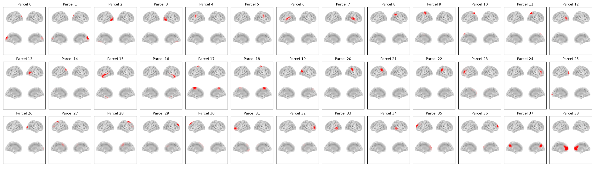

:orphan:

Giles42 Parcellation
====================

In osl-dynamics, this parcellation file is named :code:`atlas-Giles_nparc-42_space-MNI_res-8x8x8.nii.gz`, however, this parcellation file was previously named :code:`fmri_d100_parcellation_with_3PCC_ips_reduced_2mm_ss5mm_ds8mm_adj.nii.gz` (both names will work).

This is a modified version of the :doc:`original Giles parcellation <giles38>` to include the PCC plus 2 other parcels near it.

This parcellation was used in `D. Vidaurre, et al. (2018) <https://www.nature.com/articles/s41467-018-05316-z>`_.

Parcels
-------

Example Code
------------

Example code for plotting with this parcellation:

.. code::

    from osl_dynamics.analysis import power

    power.save(
        ...,
        mask_file="MNI152_T1_8mm_brain.nii.gz",
        parcellation_file="atlas-Giles_nparc-42_space-MNI_res-8x8x8.nii.gz",
        filename="map_.png",
    )
