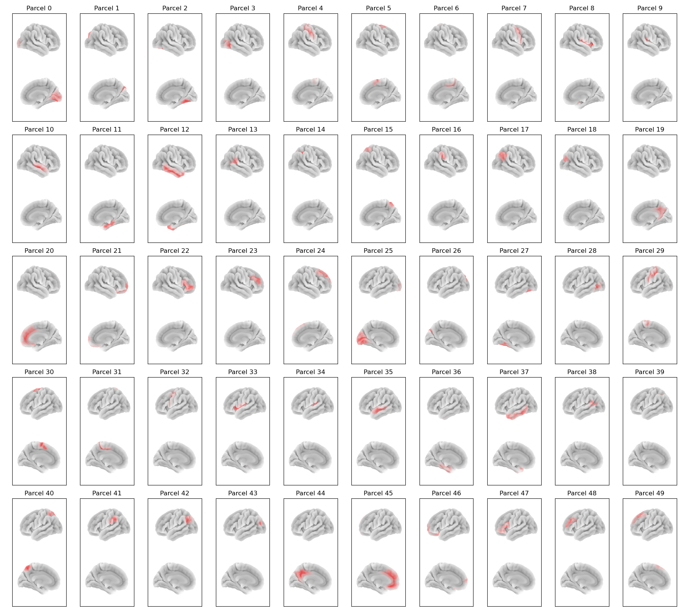

:orphan:

Glasser50 Parcellation
======================

In osl-dynamics, this parcellation file is named :code:`atlas-Glasser_nparc-50_space-MNI_res-8x8x8.nii.gz`, however, this parcellation file was previously named :code:`Glasser50_binary_space-MNI152NLin6_res-8x8x8.nii.gz` (both names will work).

This is a reduced version of the :doc:`Glasser52 parcellation <glasser52>`.

Parcels
-------

Labels and MNI coordinates:

+-------+--------------------------------------------------------------+------------+--------+--------+--------+
| Index | Parcel                                                       | Hemisphere | X      | Y      | Z      |
+=======+==============================================================+============+========+========+========+
| 0     | Primary and Early Visual Cortex                              | right      | 14.1   | -81.3  | 1.0    |
+-------+--------------------------------------------------------------+------------+--------+--------+--------+
| 1     | Dorsal Stream Visual Cortex                                  | right      | 18.7   | -81.6  | 32.8   |
+-------+--------------------------------------------------------------+------------+--------+--------+--------+
| 2     | Ventral Stream Visual Cortex                                 | right      | 29.3   | -57.3  | -16.4  |
+-------+--------------------------------------------------------------+------------+--------+--------+--------+
| 3     | MT+ Complex and Neighboring Visual Areas                     | right      | 43.7   | -72.1  | -0.7   |
+-------+--------------------------------------------------------------+------------+--------+--------+--------+
| 4     | Somatosensory and Motor Cortex                               | right      | 37.3   | -21.9  | 51.1   |
+-------+--------------------------------------------------------------+------------+--------+--------+--------+
| 5     | Supplementary Motor Area                                     | right      | 13.1   | -1.0   | 64.1   |
+-------+--------------------------------------------------------------+------------+--------+--------+--------+
| 6     | Cingulate Motor Areas & Area 5                               | right      | 8.0    | -30.7  | 53.3   |
+-------+--------------------------------------------------------------+------------+--------+--------+--------+
| 7     | Premotor Cortex                                              | right      | 42.8   | 1.2    | 40.6   |
+-------+--------------------------------------------------------------+------------+--------+--------+--------+
| 8     | Insular & Frontoparietal Operculum                           | right      | 40.7   | 1.2    | 2.9    |
+-------+--------------------------------------------------------------+------------+--------+--------+--------+
| 9     | Early Auditory Cortex                                        | right      | 46.3   | -23.3  | 12.2   |
+-------+--------------------------------------------------------------+------------+--------+--------+--------+
| 10    | Auditory Association Cortex                                  | right      | 55.6   | -12.3  | -7.1   |
+-------+--------------------------------------------------------------+------------+--------+--------+--------+
| 11    | Medial Temporal Cortex                                       | right      | 27.6   | -21.6  | -24.5  |
+-------+--------------------------------------------------------------+------------+--------+--------+--------+
| 12    | Lateral Temporal Cortex                                      | right      | 48.1   | -14.5  | -26.8  |
+-------+--------------------------------------------------------------+------------+--------+--------+--------+
| 13    | Temporal-Parieto-Occipital Junction                          | right      | 54.9   | -47.0  | 12.6   |
+-------+--------------------------------------------------------------+------------+--------+--------+--------+
| 14    | Medial Bank of the Intra-parietal Sulcus                     | right      | 29.6   | -51.6  | 44.6   |
+-------+--------------------------------------------------------------+------------+--------+--------+--------+
| 15    | Superior Medial Parietal Cortex                              | right      | 18.4   | -58.2  | 59.6   |
+-------+--------------------------------------------------------------+------------+--------+--------+--------+
| 16    | Inferior Parietal Cortex Task-Positive Network               | right      | 57.4   | -29.4  | 35.4   |
+-------+--------------------------------------------------------------+------------+--------+--------+--------+
| 17    | Inferior Parietal Cortex Task-Negative Network               | right      | 47.6   | -57.9  | 35.2   |
+-------+--------------------------------------------------------------+------------+--------+--------+--------+
| 18    | Intraparietal Sulcus & PGP                                   | right      | 36.1   | -71.9  | 32.0   |
+-------+--------------------------------------------------------------+------------+--------+--------+--------+
| 19    | Posterior Cingulate Cortex                                   | right      | 8.9    | -55.8  | 27.7   |
+-------+--------------------------------------------------------------+------------+--------+--------+--------+
| 20    | Anterior Cingulate and Medial Prefrontal Cortex              | right      | 5.1    | 34.4   | 15.2   |
+-------+--------------------------------------------------------------+------------+--------+--------+--------+
| 21    | Orbital and Polar Frontal Cortex                             | right      | 18.2   | 46.9   | -12.3  |
+-------+--------------------------------------------------------------+------------+--------+--------+--------+
| 22    | Inferior Frontal Cortex                                      | right      | 45.1   | 33.1   | 2.4    |
+-------+--------------------------------------------------------------+------------+--------+--------+--------+
| 23    | Inferior Dorso-Lateral Prefrontal Cortex                     | right      | 36.8   | 37.5   | 25.6   |
+-------+--------------------------------------------------------------+------------+--------+--------+--------+
| 24    | Superior Dorso-Lateral Prefrontal Cortex                     | right      | 20.4   | 32.9   | 46.1   |
+-------+--------------------------------------------------------------+------------+--------+--------+--------+
| 25    | Primary and Early Visual Cortex                              | left       | -14.4  | -82.3  | 1.3    |
+-------+--------------------------------------------------------------+------------+--------+--------+--------+
| 26    | Dorsal Stream Visual Cortex                                  | left       | -21.4  | -83.4  | 30.0   |
+-------+--------------------------------------------------------------+------------+--------+--------+--------+
| 27    | Ventral Stream Visual Cortex                                 | left       | -34.2  | -57.8  | -17.4  |
+-------+--------------------------------------------------------------+------------+--------+--------+--------+
| 28    | MT+ Complex and Neighboring Visual Areas                     | left       | -47.4  | -70.9  | -1.9   |
+-------+--------------------------------------------------------------+------------+--------+--------+--------+
| 29    | Somatosensory and Motor Cortex                               | left       | -36.4  | -24.7  | 52.7   |
+-------+--------------------------------------------------------------+------------+--------+--------+--------+
| 30    | Supplementary Motor Area                                     | left       | -13.2  | -2.0   | 63.8   |
+-------+--------------------------------------------------------------+------------+--------+--------+--------+
| 31    | Cingulate Motor Areas & Area 5                               | left       | -10.6  | -28.8  | 52.1   |
+-------+--------------------------------------------------------------+------------+--------+--------+--------+
| 32    | Premotor Cortex                                              | left       | -43.7  | -0.8   | 42.7   |
+-------+--------------------------------------------------------------+------------+--------+--------+--------+
| 33    | Insular & Frontoparietal Operculum                           | left       | -43.7  | -0.2   | 3.1    |
+-------+--------------------------------------------------------------+------------+--------+--------+--------+
| 34    | Early Auditory Cortex                                        | left       | -49.2  | -25.9  | 10.6   |
+-------+--------------------------------------------------------------+------------+--------+--------+--------+
| 35    | Auditory Association Cortex                                  | left       | -58.0  | -14.4  | -7.0   |
+-------+--------------------------------------------------------------+------------+--------+--------+--------+
| 36    | Medial Temporal Cortex                                       | left       | -30.7  | -22.7  | -24.4  |
+-------+--------------------------------------------------------------+------------+--------+--------+--------+
| 37    | Lateral Temporal Cortex                                      | left       | -51.5  | -17.5  | -25.4  |
+-------+--------------------------------------------------------------+------------+--------+--------+--------+
| 38    | Temporal-Parieto-Occipital Junction                          | left       | -57.3  | -51.8  | 13.9   |
+-------+--------------------------------------------------------------+------------+--------+--------+--------+
| 39    | Medial Bank of the Intra-parietal Sulcus                     | left       | -32.7  | -52.2  | 43.0   |
+-------+--------------------------------------------------------------+------------+--------+--------+--------+
| 40    | Superior Medial Parietal Cortex                              | left       | -19.4  | -59.7  | 57.7   |
+-------+--------------------------------------------------------------+------------+--------+--------+--------+
| 41    | Inferior Parietal Cortex Task-Positive Network               | left       | -59.5  | -35.0  | 33.7   |
+-------+--------------------------------------------------------------+------------+--------+--------+--------+
| 42    | Inferior Parietal Cortex Task-Negative Network               | left       | -47.6  | -64.0  | 34.4   |
+-------+--------------------------------------------------------------+------------+--------+--------+--------+
| 43    | Intraparietal Sulcus & PGP                                   | left       | -37.4  | -72.1  | 31.3   |
+-------+--------------------------------------------------------------+------------+--------+--------+--------+
| 44    | Posterior Cingulate Cortex                                   | left       | -8.7   | -52.3  | 29.7   |
+-------+--------------------------------------------------------------+------------+--------+--------+--------+
| 45    | Anterior Cingulate and Medial Prefrontal Cortex              | left       | -6.1   | 35.1   | 12.0   |
+-------+--------------------------------------------------------------+------------+--------+--------+--------+
| 46    | Orbital and Polar Frontal Cortex                             | left       | -20.9  | 45.3   | -10.3  |
+-------+--------------------------------------------------------------+------------+--------+--------+--------+
| 47    | Inferior Frontal Cortex                                      | left       | -47.2  | 29.3   | 4.7    |
+-------+--------------------------------------------------------------+------------+--------+--------+--------+
| 48    | Inferior Dorso-Lateral Prefrontal Cortex                     | left       | -39.8  | 36.7   | 24.6   |
+-------+--------------------------------------------------------------+------------+--------+--------+--------+
| 49    | Superior Dorso-Lateral Prefrontal Cortex                     | left       | -23.1  | 30.2   | 47.3   |
+-------+--------------------------------------------------------------+------------+--------+--------+--------+

Example Code
------------

Example code for plotting with this parcellation:

.. code::

    from osl_dynamics.analysis import power

    power.save(
        ...,
        mask_file="MNI152_T1_8mm_brain.nii.gz",
        parcellation_file="atlas-Glasser_nparc-50_space-MNI_res-8x8x8.nii.gz",
        filename="map_.png",
    )
