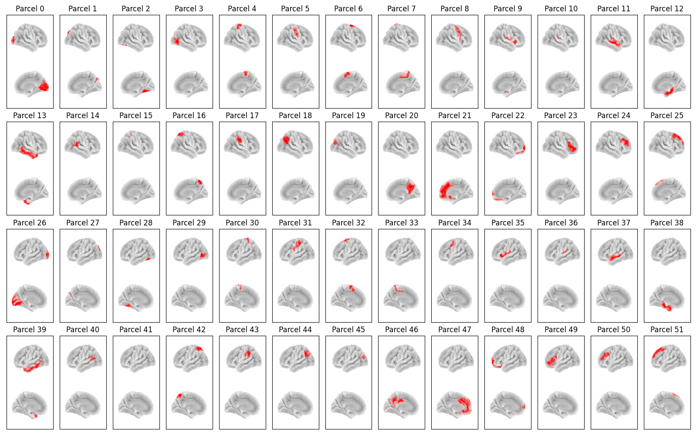

:orphan:

Glasser52 Parcellation
======================

In osl-dynamics, this parcellation file is named :code:`atlas-Glasser_nparc-52_space-MNI_res-8x8x8.nii.gz`, however, this parcellation file was previously named :code:`Glasser52_binary_space-MNI152NLin6_res-8x8x8.nii.gz` (both names will work).

This parcellation was based on the `HCP-MMP <https://pmc.ncbi.nlm.nih.gov/articles/PMC4990127/>`_ atlas.

Parcels
-------

Labels and MNI coordinates:

+-------+--------------------------------------------------+------------+--------+--------+--------+
| Index.| Parcel                                           | Hemisphere | X      | Y      | Z      |
+=======+==================================================+============+========+========+========+
| 0     | Primary and Early Visual Cortex                  | right      | 14.5   | -80.5  | -0.4   |
+-------+--------------------------------------------------+------------+--------+--------+--------+
| 1     | Dorsal Stream Visual Cortex                      | right      | 19.4   | -81.4  | 30.6   |
+-------+--------------------------------------------------+------------+--------+--------+--------+
| 2     | Ventral Stream Visual Cortex                     | right      | 29.9   | -57.6  | -17.7  |
+-------+--------------------------------------------------+------------+--------+--------+--------+
| 3     | MT+ Complex and Neighboring Visual Areas         | right      | 42.2   | -71.5  | 0.0    |
+-------+--------------------------------------------------+------------+--------+--------+--------+
| 4     | Superior Somatosnesory and Motor Cortex          | right      | 23.6   | -29.5  | 61.0   |
+-------+--------------------------------------------------+------------+--------+--------+--------+
| 5     | Inferior Somatosnesory and Motor Cortex          | right      | 49.1   | -13.4  | 38.3   |
+-------+--------------------------------------------------+------------+--------+--------+--------+
| 6     | Supplementory Motor Area                         | right      | 12.7   | -2.2   | 62.9   |
+-------+--------------------------------------------------+------------+--------+--------+--------+
| 7     | Cingulate Motor Areas & Area 5                   | right      | 10.0   | -31.2  | 53.6   |
+-------+--------------------------------------------------+------------+--------+--------+--------+
| 8     | Premotor Cortex                                  | right      | 40.9   | 0.9    | 41.1   |
+-------+--------------------------------------------------+------------+--------+--------+--------+
| 9     | Insular & Frontoparietal Operculum               | right      | 37.7   | 1.6    | 4.0    |
+-------+--------------------------------------------------+------------+--------+--------+--------+
| 10    | Early Auditory Cortex                            | right      | 40.2   | -27.5  | 13.5   |
+-------+--------------------------------------------------+------------+--------+--------+--------+
| 11    | Auditory Association Cortex                      | right      | 55.0   | -14.0  | -6.5   |
+-------+--------------------------------------------------+------------+--------+--------+--------+
| 12    | Medial Temporal Cortex                           | right      | 25.0   | -22.1  | -22.1  |
+-------+--------------------------------------------------+------------+--------+--------+--------+
| 13    | Lateral Temporal Cortex                          | right      | 48.5   | -16.3  | -25.3  |
+-------+--------------------------------------------------+------------+--------+--------+--------+
| 14    | Temporal-Parieto-Occipital Junction              | right      | 52.1   | -48.1  | 12.3   |
+-------+--------------------------------------------------+------------+--------+--------+--------+
| 15    | Medial Bank of the Intra-parietal Sulcus         | right      | 29.5   | -51.0  | 43.0   |
+-------+--------------------------------------------------+------------+--------+--------+--------+
| 16    | Superior Medial Parietal Cortex                  | right      | 19.1   | -58.4  | 59.6   |
+-------+--------------------------------------------------+------------+--------+--------+--------+
| 17    | Inferior Parietal Cortex Task-Positive Network   | right      | 56.7   | -29.7  | 35.7   |
+-------+--------------------------------------------------+------------+--------+--------+--------+
| 18    | Inferior Parietal Cortex Task-Negative Network   | right      | 47.4   | -56.1  | 35.8   |
+-------+--------------------------------------------------+------------+--------+--------+--------+
| 19    | Intraparietal Sulcus & PGP                       | right      | 36.5   | -71.1  | 32.6   |
+-------+--------------------------------------------------+------------+--------+--------+--------+
| 20    | Posterior Cingulate Cortex                       | right      | 10.3   | -55.1  | 26.8   |
+-------+--------------------------------------------------+------------+--------+--------+--------+
| 21    | Anterior Cingulate and Medial Prefrontal Cortex  | right      | 6.1    | 33.8   | 14.2   |
+-------+--------------------------------------------------+------------+--------+--------+--------+
| 22    | Orbital and Polar Frontal Cortex                 | right      | 17.1   | 47.0   | -11.6  |
+-------+--------------------------------------------------+------------+--------+--------+--------+
| 23    | Inferior Frontal Cortex                          | right      | 45.4   | 32.5   | 3.8    |
+-------+--------------------------------------------------+------------+--------+--------+--------+
| 24    | Inferior Dorso-Lateral Prefrontal Cortex         | right      | 34.8   | 37.1   | 25.7   |
+-------+--------------------------------------------------+------------+--------+--------+--------+
| 25    | Superior Dorso-Lateral Prefrontal Cortex         | right      | 21.0   | 31.9   | 45.9   |
+-------+--------------------------------------------------+------------+--------+--------+--------+
| 26    | Primary and Early Visual Cortex                  | left       | -16.9  | -82.0  | -0.9   |
+-------+--------------------------------------------------+------------+--------+--------+--------+
| 27    | Dorsal Stream Visual Cortex                      | left       | -21.7  | -84.3  | 27.0   |
+-------+--------------------------------------------------+------------+--------+--------+--------+
| 28    | Ventral Stream Visual Cortex                     | left       | -34.5  | -56.0  | -18.6  |
+-------+--------------------------------------------------+------------+--------+--------+--------+
| 29    | MT+ Complex and Neighboring Visual Areas         | left       | -45.2  | -70.3  | -1.4   |
+-------+--------------------------------------------------+------------+--------+--------+--------+
| 30    | Superior Somatosnesory and Motor Cortex          | left       | -22.6  | -30.4  | 62.8   |
+-------+--------------------------------------------------+------------+--------+--------+--------+
| 31    | Inferior Somatosnesory and Motor Cortex          | left       | -48.3  | -18.7  | 41.7   |
+-------+--------------------------------------------------+------------+--------+--------+--------+
| 32    | Supplementory Motor Area                         | left       | -14.0  | -2.7   | 62.7   |
+-------+--------------------------------------------------+------------+--------+--------+--------+
| 33    | Cingulate Motor Areas & Area 5                   | left       | -14.4  | -30.6  | 49.7   |
+-------+--------------------------------------------------+------------+--------+--------+--------+
| 34    | Premotor Cortex                                  | left       | -40.3  | -1.7   | 43.8   |
+-------+--------------------------------------------------+------------+--------+--------+--------+
| 35    | Insular & Frontoparietal Operculum               | left       | -41.3  | 0.1    | 3.7    |
+-------+--------------------------------------------------+------------+--------+--------+--------+
| 36    | Early Auditory Cortex                            | left       | -45.4  | -29.4  | 12.1   |
+-------+--------------------------------------------------+------------+--------+--------+--------+
| 37    | Auditory Association Cortex                      | left       | -55.3  | -17.3  | -7.8   |
+-------+--------------------------------------------------+------------+--------+--------+--------+
| 38    | Medial Temporal Cortex                           | left       | -27.9  | -22.2  | -22.6  |
+-------+--------------------------------------------------+------------+--------+--------+--------+
| 39    | Lateral Temporal Cortex                          | left       | -49.6  | -17.9  | -25.1  |
+-------+--------------------------------------------------+------------+--------+--------+--------+
| 40    | Temporal-Parieto-Occipital Junction              | left       | -53.1  | -54.0  | 14.5   |
+-------+--------------------------------------------------+------------+--------+--------+--------+
| 41    | Medial Bank of the Intra-parietal Sulcus         | left       | -31.1  | -50.0  | 41.1   |
+-------+--------------------------------------------------+------------+--------+--------+--------+
| 42    | Superior Medial Parietal Cortex                  | left       | -21.3  | -60.5  | 58.2   |
+-------+--------------------------------------------------+------------+--------+--------+--------+
| 43    | Inferior Parietal Cortex Task-Positive Network   | left       | -56.6  | -36.3  | 36.6   |
+-------+--------------------------------------------------+------------+--------+--------+--------+
| 44    | Inferior Parietal Cortex Task-Negative Network   | left       | -45.1  | -63.4  | 35.2   |
+-------+--------------------------------------------------+------------+--------+--------+--------+
| 45    | Intraparietal Sulcus & PGP                       | left       | -36.7  | -70.0  | 30.4   |
+-------+--------------------------------------------------+------------+--------+--------+--------+
| 46    | Posterior Cingulate Cortex                       | left       | -11.6  | -49.5  | 28.0   |
+-------+--------------------------------------------------+------------+--------+--------+--------+
| 47    | Anterior Cingulate and Medial Prefrontal Cortex  | left       | -8.7   | 32.0   | 11.4   |
+-------+--------------------------------------------------+------------+--------+--------+--------+
| 48    | Orbital and Polar Frontal Cortex                 | left       | -21.9  | 46.3   | -8.1   |
+-------+--------------------------------------------------+------------+--------+--------+--------+
| 49    | Inferior Frontal Cortex                          | left       | -45.1  | 28.2   | 7.7    |
+-------+--------------------------------------------------+------------+--------+--------+--------+
| 50    | Inferior Dorso-Lateral Prefrontal Cortex         | left       | -37.2  | 36.2   | 25.2   |
+-------+--------------------------------------------------+------------+--------+--------+--------+
| 51    | Superior Dorso-Lateral Prefrontal Cortex         | left       | -23.5  | 28.6   | 45.7   |
+-------+--------------------------------------------------+------------+--------+--------+--------+

Example Code
------------

Example code for plotting with this parcellation:

.. code::

    from osl_dynamics.analysis import power

    power.save(
        ...,
        mask_file="MNI152_T1_8mm_brain.nii.gz",
        parcellation_file="atlas-Glasser_nparc-52_space-MNI_res-8x8x8.nii.gz",
        filename="map_.png",
    )

Reference
---------

If you use the this parcellation, please cite:

    Kohl, O., Woolrich, M., Nobre, A. C., & Quinn, A. (2023). Glasser52: A parcellation for MEG-Analysis [Data set].
    Zenodo. https://doi.org/10.5281/zenodo.10401793

See the link for further information regarding this parcellation.

